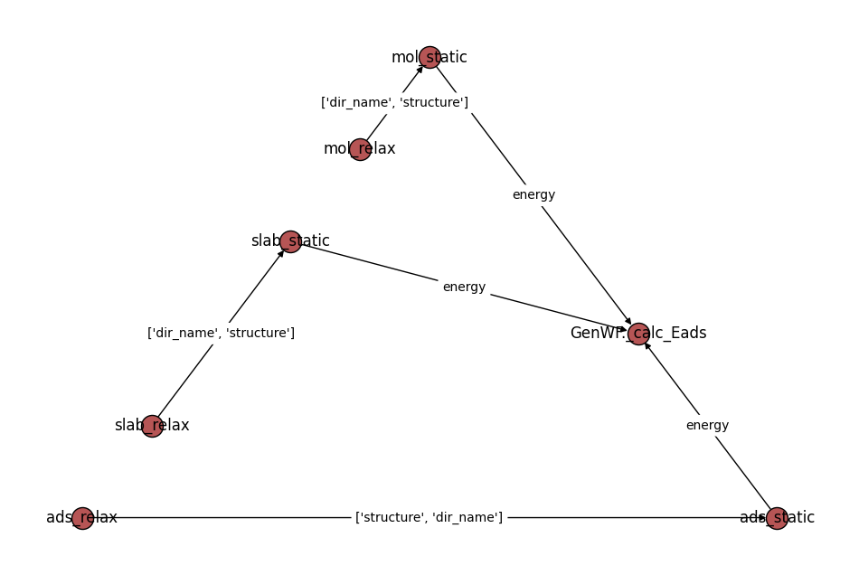

# 特定工作流

除了一些通用工作流之外,针对具体性质的计算,`easydft`还预设了一些更加具体的全自动工作，不仅包含计算任务的串联,还包含了数据后处理.

## 吸附能计算工作流

```python
from atomate2.vasp.sets.core import RelaxSetGenerator, StaticSetGenerator
from pymatgen.core import Structure
from easydft.workflow.genwf import GenWF

structure = Structure.from_file('./ads.vasp')
wf = GenWF(structure, use_custodian=False)

slab_relax_set = RelaxSetGenerator(user_incar_settings={'EDIFFG':-0.01, "ISIF":2})
slab_static_set = StaticSetGenerator(user_incar_settings={'EDIFF':1e-7})
mol_relax_set = RelaxSetGenerator(user_incar_settings={'EDIFFG':-0.01, "ISIF":2})
mol_static_set = StaticSetGenerator(user_incar_settings={'EDIFF':1e-7})

adsorption = wf.adsorption_flow(
    boundary_frac=0.55, 
    substrate_fix_frac=0.2, 
    slabrelax_set=slab_relax_set,
    slabstatic_set=slab_static_set,
    molrelax_set=mol_relax_set,
    molstatic_set=mol_static_set,
    cubic_size=20
    )
print(adsorption)
adsorption.draw_graph().show()
```

可视化工作流:



使用`adsorption_flow()`需根据计算结构额外传入`boundary_frac`, `substrate_fix_frac`和`cubic_size`参数:

- `boundary_frac`: 吸附模型中吸附质和吸附基底的分界坐标,不是唯一值,只需要选取吸附质和吸附基底之间任一分数坐标即可;<p></p>

- `substrate_fix_frac`: 计算中需要固定的基底原子,对于结构中小于传入分数坐标的原子都会被固定, 如果你的结构是二维材料,直接传入`0`即可;<p></p>

- `cubic_size`: 单独计算分子/吸附质的晶格大小.<p></p>

## 粘附功计算工作流

跟吸附能工作流类似:

```python
from pymatgen.core import Structure
from easydft.workflow.genwf import GenWF

structure = Structure.from_file('./heterojunction.vasp')
wf = GenWF(structure, use_custodian=False)
adhesive_work = wf.adhesive_work_flow(boundary_frac=0.55, substrate_fix_frac=0.2, film_fix_frac=0.7, double_fix_heter=True)
print(adhesive_work)
adhesive_work.draw_graph().show()
```

- `boudary_frac`: 同样需要传入异质结分界分数坐标;<p></p>

- `double_fix_heter`: 对于原子数较多的模型, 可以固定表层和底层原子,只优化界面处原子, 此时需要经验构建合理层间距, 默认关闭<p></p>

- `substrate_fix_frac`和`film_fix_frac`: 需要固定的原子,film结构固定的是(film_fix_frac ~ 1.0)之间的原子, 当`double_fix_heter = False`时, 即使传入`film_fix_frac`也不会固定film结构原子.<p></p>

**注: 若`substrate_fix_frac`和`film_fix_frac`不指定数值,则默认分别固定substrate和film一半原子.**