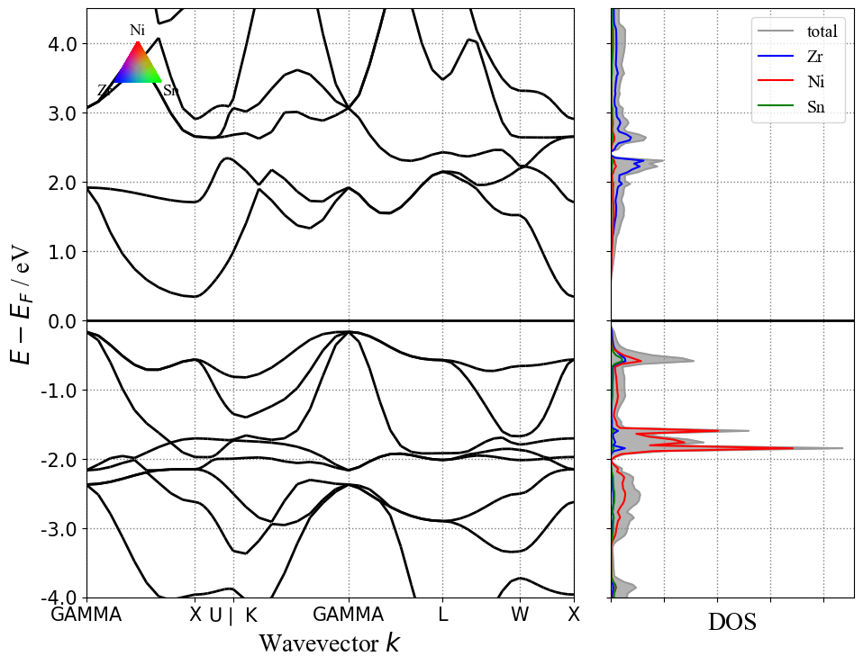
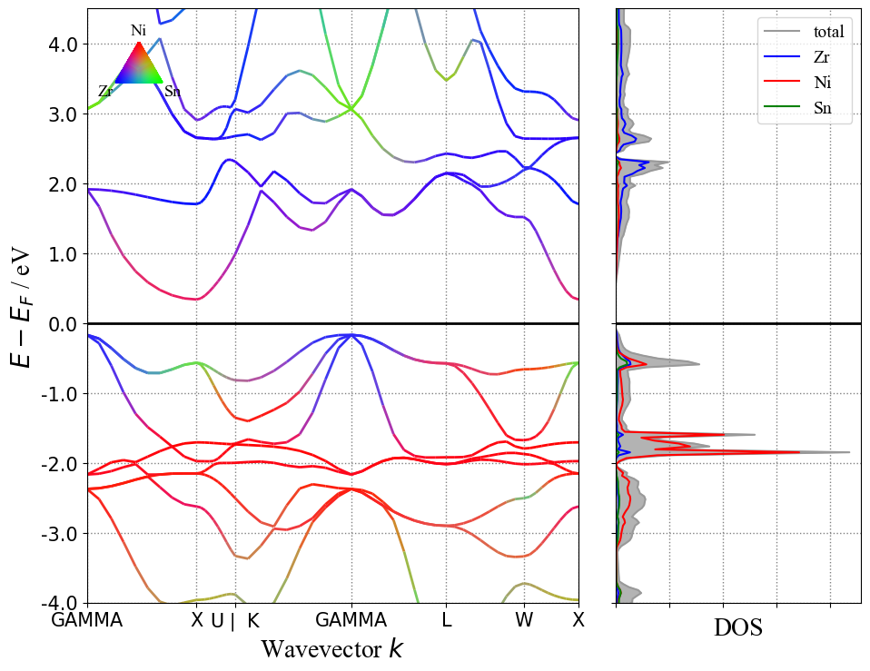
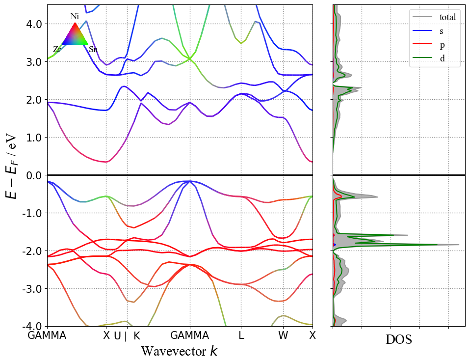
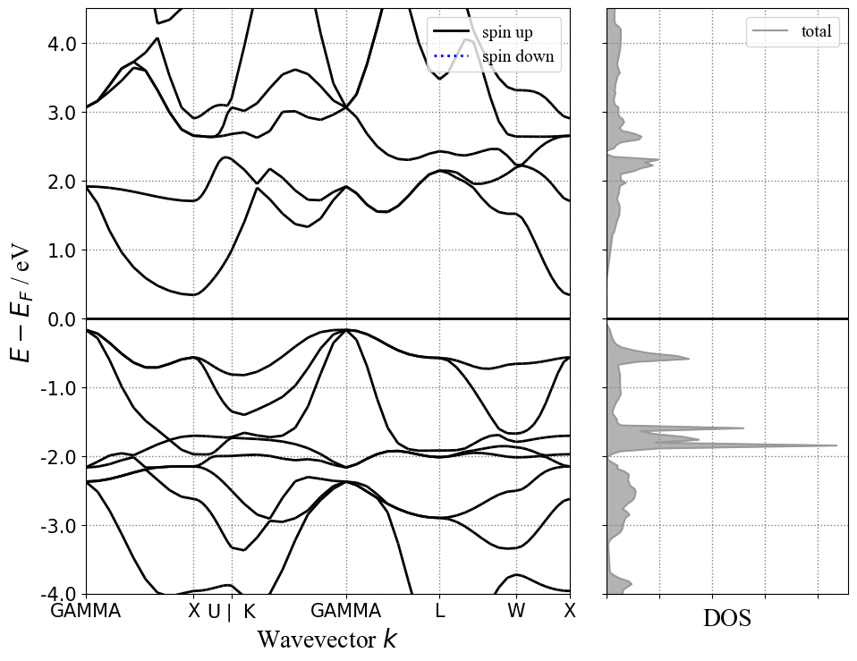

# 10. 能带态密度图合并绘制

 ***¡Hola a todos!***

本章介绍如何把能带态密度画在一起，也就是常见的能带图在左，态密度图垂直在右分布。这里需要调用的模块为`BSDOSPlotter()`。

代码如下：

```python
from pymatgen.electronic_structure.plotter import BSDOSPlotter
from pymatgen.io.vasp.outputs import Vasprun

# 读取dos计算vasprun.xml文件
dos_vasprun = Vasprun("../ZrNiSn_primitive/dos/vasprun.xml")
dos = dos_vasprun.complete_dos

# 读取band计算vasprun.xml文件
band_vasprun = Vasprun("../ZrNiSn_primitive/band/vasprun.xml")
band = band_vasprun.get_band_structure(line_mode=True)

# 实例化BSDOSPlotter类
plotter = BSDOSPlotter()
# 画图
plotter.get_plot(bs=band,dos=dos)
```

运行代码：



#### 绘制元素/轨道投影

绘制能带元素投影时，需要在读取`vasprun.xml`文件时增加提取投影信息的参数：`Vasprun("vasprun.xml",parse_projected_eigen=True)`

修改代码如下：

```python
from pymatgen.electronic_structure.plotter import BSDOSPlotter
from pymatgen.io.vasp.outputs import Vasprun
from mp_api.client import MPRester

# 读取dos计算vasprun.xml文件
dos_vasprun = Vasprun("../ZrNiSn_primitive/dos/vasprun.xml",parse_projected_eigen=True)
dos = dos_vasprun.complete_dos

# 读取band计算vasprun.xml文件
band_vasprun = Vasprun("../ZrNiSn_primitive/band/vasprun.xml",parse_projected_eigen=True)
band = band_vasprun.get_band_structure(line_mode=True)

# 实例化BSDOSPlotter类
plotter = BSDOSPlotter()
# 画图
plotter.get_plot(bs=band,dos=dos)
```

运行代码：



此时可以看到左边的能带图也对应显示了元素的投影。

该方法默认为`band`和`dos`采用元素投影，初次之外`dos`还提供了轨道投影选项，需要在实例化`BSDOSPlotter()`时增加`dos_projection='orbitals'`参数：

```python
from pymatgen.electronic_structure.plotter import BSDOSPlotter
from pymatgen.io.vasp.outputs import Vasprun

# 读取dos计算vasprun.xml文件
dos_vasprun = Vasprun("../ZrNiSn_primitive/dos/vasprun.xml",parse_projected_eigen=True)
dos = dos_vasprun.complete_dos

# 读取band计算vasprun.xml文件
band_vasprun = Vasprun("../ZrNiSn_primitive/band/vasprun.xml",parse_projected_eigen=True)
band = band_vasprun.get_band_structure(line_mode=True)

# 实例化BSDOSPlotter类，态密度为轨道投影
plotter = BSDOSPlotter(dos_projection='orbitals')
# 画图
plotter.get_plot(bs=band,dos=dos)
```

运行代码：



如果只想表现TDOS，则在实例化`BSDOSPlotter()`时设置`dos_projection='None'`和`bs_projection=None`：

```python
from pymatgen.electronic_structure.plotter import BSDOSPlotter
from pymatgen.io.vasp.outputs import Vasprun

# 读取dos计算vasprun.xml文件
dos_vasprun = Vasprun("../ZrNiSn_primitive/dos/vasprun.xml",parse_projected_eigen=True)
dos = dos_vasprun.complete_dos

# 读取band计算vasprun.xml文件
band_vasprun = Vasprun("../ZrNiSn_primitive/band/vasprun.xml",parse_projected_eigen=True)
band = band_vasprun.get_band_structure(line_mode=True)

# 实例化BSDOSPlotter类
plotter = BSDOSPlotter(bs_projection=None,dos_projection=None)
# 画图
plotter.get_plot(bs=band,dos=dos)
```

运行代码：



最后，需要调整y轴范围、线条颜色，字体大小，图例大小等，都可以在实例化`BSDOSPlotter()`时设置相应的参数：

> - **bs_projection** ( *'elements'*   *|*  *None*) – Whether to project the bands onto elements.
> - **dos_projection** (*str*) – “elements”, “orbitals”, or None
> - **vb_energy_range** (*float*) – energy in eV to show of valence bands
> - **cb_energy_range** (*float*) – energy in eV to show of conduction bands
> - **fixed_cb_energy** (*bool*) – If true, the cb_energy_range will be interpreted as constant (i.e., no gap correction for cb energy)
> - **egrid_interval** (*float*) – interval for grid marks
> - **font** (*str*) – font family
> - **axis_fontsize** (*float*) – font size for axis
> - **tick_fontsize** (*float*) – font size for axis tick labels
> - **legend_fontsize** (*float*) – font size for legends
> - **bs_legend** (*str*) – matplotlib string location for legend or None
> - **dos_legend** (*str*) – matplotlib string location for legend or None
> - **rgb_legend** (*bool*) – (T/F) whether to draw RGB triangle/bar for element proj.
> - **fig_size** (*tuple*) – dimensions of figure size (width, height)

 ***¡Muchas gracias!***
