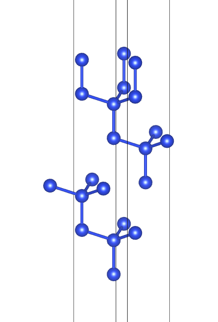
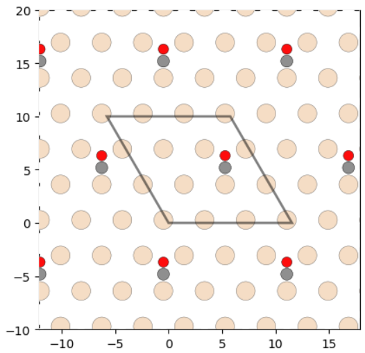
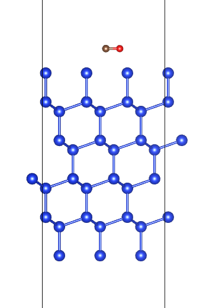
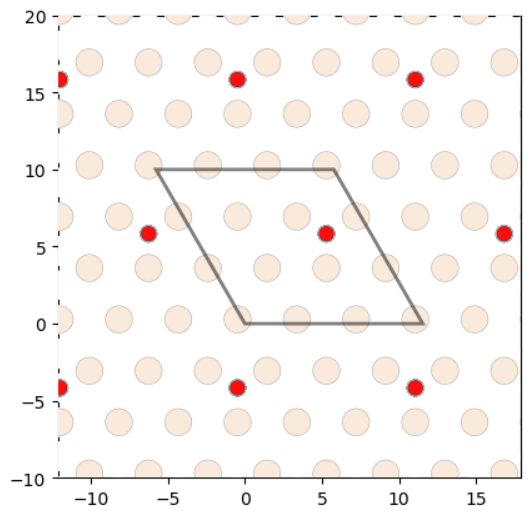
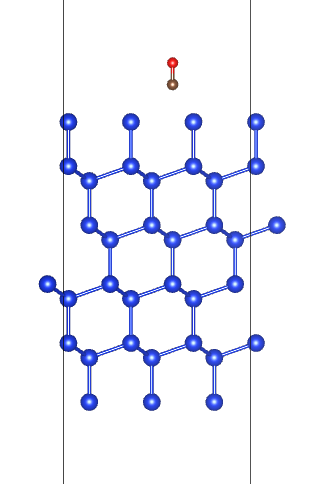

# 13. 自动生成吸附模型

 ***¡Hola a todos!***

本章介绍如何在`slab`模型表面自动搜索吸附位点并生成吸附模型。

### AdsorbateSiteFinder搜索吸附位点

`AdsorbateSiteFinder`模块主要用于搜索`slab`模型表面潜在的吸附位点，主要分为三大类：`ontop`、`bridge`、`hollow`。首先导入`AdsorbateSiteFinder`模块：

```python
from pymatgen.analysis.adsorption import AdsorbateSiteFinder
```

`slab`模型以`Si(111)`面为例，关于如何自动切`slab`模型可以参考往期内容。

模型：



```python
from pymatgen.analysis.adsorption import AdsorbateSiteFinder
from pymatgen.core.structure import Structure

# 读取结构
Si_111 = Structure.from_file("./Si_111.cif")

# 实例化
asf = AdsorbateSiteFinder(Si_111)
# 搜索吸附位点
adsorption_sites = asf.find_adsorption_sites()
```

调用`find_adsorption_sites()`方法搜索吸附位点，`find_adsorption_sites()`默认的吸附距离为2埃。可以传入`distance`参数进行覆盖

```python
from pymatgen.analysis.adsorption import AdsorbateSiteFinder
from pymatgen.core.structure import Structure
from pprint import pprint

# 读取结构
Si_111 = Structure.from_file("./Si_111.cif")
# 3x3x1超胞
Si_111.make_supercell([3, 3, 1])

# 实例化
asf = AdsorbateSiteFinder(Si_111)
# 搜索吸附位点
adsorption_sites = asf.find_adsorption_sites()
# 打印吸附位点
pprint(adsorption_sites)
```

运行代码，可以得到所有潜在吸附位点的坐标：

```tex
{'all': [array([ 3.36811902,  0.27779776, 28.32198049]),
         array([12.02899646, 15.27887752, 28.32198049]),
         array([11.06667674, 15.83447306, 28.32198049]),
         array([ 9.14203731, 14.72328197, 28.32198049])],
 'bridge': [array([12.02899646, 15.27887752, 28.32198049])],
 'hollow': [array([11.06667674, 15.83447306, 28.32198049]),
            array([ 9.14203731, 14.72328197, 28.32198049])],
 'ontop': [array([ 3.36811902,  0.27779776, 28.32198049])]}
```

初次之外，还可以导入`plot_slab()`方法实现可视化，代码如下：

```python
from pymatgen.analysis.adsorption import AdsorbateSiteFinder, plot_slab	
from matplotlib import pyplot as plt

# 读取结构
Si_111 = Structure.from_file("./Si_111.cif")
# 3x3x1超胞
Si_111.make_supercell([3, 3, 1])

# 实例化
asf = AdsorbateSiteFinder(Si_111)
# 搜索吸附位点
adsorption_sites = asf.find_adsorption_sites()

fig = plt.figure()
plot_slab(slab, ax=fig.add_subplot(111), adsorption_sites=True)
plt.show()
```

`plot_slab()`主要需要传入三个参数：

- `slab`：表面模型
- `ax`：`matplotlib`对象用于绘图
- `adsorption_sites`：是否显示吸附位点标识

运行代码后可得到：


深色表示最表层原子，浅色表示次表层原子；平行四边形框表示`3x3x1`超胞的`Si_111`结构，`X`表示对应的潜在吸附位点。

### 添加吸附原子/分子

搜索完吸附位点后，下一步需要给`slab`增加吸附的原子/分子，最直接的方法为直接写对应的原子分子坐标，然后传入，以吸附`CO`为例，代码如下：

```python
from pymatgen.core.structure import Structure
from pymatgen.analysis.adsorption import AdsorbateSiteFinder, plot_slab
from pymatgen.core.structure import Molecule
from matplotlib import pyplot as plt


# 读取结构
Si_111 = Structure.from_file("./Si_111.cif")
# 3x3x1超胞
Si_111.make_supercell([3, 3, 1])

# 实例化
asf = AdsorbateSiteFinder(Si_111)
# 搜索吸附位点
adsorption_sites = asf.find_adsorption_sites()

# 创建CO分子
CO = Molecule(("C","O"), [[0, 0, 0], [0, 1.128, 0]])
# 生成吸附结构
absorbed_structure = asf.add_adsorbate(molecule=CO, ads_coord=adsorption_sites['hollow'][0])

# 可视化
fig = plt.figure()
plot_slab(absorbed_structure, ax=fig.add_subplot(111), adsorption_sites=False)
plt.show()
```

首先，该方法先要导入`Molecule`模块，`Molecule`仅需要传入，原子元素种类及对应的坐标，且一一对应。这里传入的坐标对应的空间与`slab`模型无关，可以认为是在一个空盒子里面构建分子。

然后，调用`AdsorbateSiteFinder`模块的`add_adsorbate()`方法把吸附分子加在`slab`上。

`add_adsorbate()`需要读取分子结构`molecule=CO`，以及吸附坐标`ads_coord=adsorption_sites['hollow'][0]`，这里坐标选取第一个`hollow`位。

运行代码：



结果显示`CO`的吸附情况，可以导出`cif`结构查看：

```python
......
absorbed_structure = asf.add_adsorbate(molecule=CO, ads_coord=adsorption_sites['hollow'][0])
absorbed_structure.to('./Si111_CO.cif')
......
```

`VESTA`查看：



### 进阶用法

上述操作中，如果每次吸附分子都需要自己写坐标的话，确实会比较麻烦。对于复杂的分子，自己写坐标的难度也比较大。

因此，这里推荐调用`ase`来自动导入分子结构，主要用到的模块为：

```python
from ase.build.molecule import molecule

# 构建CO分子
CO = molecule("CO")
```

`ase`的`molecule`模块支持输入常见的分子化学式就可以构建对应的分子结构，可以通过如下代码查看支持的分子种类：

```python
from ase.build.molecule import extra
from ase.collections import g2

print(g2.names)
print(extra.keys())
```

运行代码：

```tex
['PH3', 'P2', 'CH3CHO', 'H2COH', 'CS', 'OCHCHO', 'C3H9C', 'CH3COF', 'CH3CH2OCH3', 'HCOOH', 'HCCl3', 'HOCl', 'H2', 'SH2', 'C2H2', 'C4H4NH', 'CH3SCH3', 'SiH2_s3B1d', 'CH3SH', 'CH3CO', 'CO', 'ClF3', 'SiH4', 'C2H6CHOH', 'CH2NHCH2', 'isobutene', 'HCO', 'bicyclobutane', 'LiF', 'Si', 'C2H6', 'CN', 'ClNO', 'S', 'SiF4', 'H3CNH2', 'methylenecyclopropane', 'CH3CH2OH', 'F', 'NaCl', 'CH3Cl', 'CH3SiH3', 'AlF3', 'C2H3', 'ClF', 'PF3', 'PH2', 'CH3CN', 'cyclobutene', 'CH3ONO', 'SiH3', 'C3H6_D3h', 'CO2', 'NO', 'trans-butane', 'H2CCHCl', 'LiH', 'NH2', 'CH', 'CH2OCH2', 'C6H6', 'CH3CONH2', 'cyclobutane', 'H2CCHCN', 'butadiene', 'C', 'H2CO', 'CH3COOH', 'HCF3', 'CH3S', 'CS2', 'SiH2_s1A1d', 'C4H4S', 'N2H4', 'OH', 'CH3OCH3', 'C5H5N', 'H2O', 'HCl', 'CH2_s1A1d', 'CH3CH2SH', 'CH3NO2', 'Cl', 'Be', 'BCl3', 'C4H4O', 'Al', 'CH3O', 'CH3OH', 'C3H7Cl', 'isobutane', 'Na', 'CCl4', 'CH3CH2O', 'H2CCHF', 'C3H7', 'CH3', 'O3', 'P', 'C2H4', 'NCCN', 'S2', 'AlCl3', 'SiCl4', 'SiO', 'C3H4_D2d', 'H', 'COF2', '2-butyne', 'C2H5', 'BF3', 'N2O', 'F2O', 'SO2', 'H2CCl2', 'CF3CN', 'HCN', 'C2H6NH', 'OCS', 'B', 'ClO', 'C3H8', 'HF', 'O2', 'SO', 'NH', 'C2F4', 'NF3', 'CH2_s3B1d', 'CH3CH2Cl', 'CH3COCl', 'NH3', 'C3H9N', 'CF4', 'C3H6_Cs', 'Si2H6', 'HCOOCH3', 'O', 'CCH', 'N', 'Si2', 'C2H6SO', 'C5H8', 'H2CF2', 'Li2', 'CH2SCH2', 'C2Cl4', 'C3H4_C3v', 'CH3COCH3', 'F2', 'CH4', 'SH', 'H2CCO', 'CH3CH2NH2', 'Li', 'N2', 'Cl2', 'H2O2', 'Na2', 'BeH', 'C3H4_C2v', 'NO2']
dict_keys(['Be2', 'C7NH5', 'BDA', 'biphenyl', 'C60'])
```

**Note**：`ase`得到的分子结构不能直接使用，还需要转化成pymatgen可以读取的格式，需要用到`AseAtomsAdaptor`，完整代码如下：

```python
from ase.build.molecule import molecule
from pymatgen.io.ase import AseAtomsAdaptor
from pymatgen.core.structure import Structure
from pymatgen.analysis.adsorption import AdsorbateSiteFinder, plot_slab
from matplotlib import pyplot as plt

# 读取结构
Si_111 = Structure.from_file("./Si_111.cif")
# 3x3x1超胞
Si_111.make_supercell([3, 3, 1])

# 实例化
asf = AdsorbateSiteFinder(Si_111)
# 搜索吸附位点
adsorption_sites = asf.find_adsorption_sites()

# ase创建CO分子
CO = molecule("CO")
# 转化成pymatgen格式
pmg_CO = AseAtomsAdaptor.get_molecule(CO)
# 生成吸附结构
absorbed_structure = asf.add_adsorbate(molecule=pmg_CO, ads_coord=adsorption_sites['hollow'][0])

# 可视化
fig = plt.figure()
plot_slab(absorbed_structure, ax=fig.add_subplot(111), adsorption_sites=False)
plt.show()
```

运行代码：



导出cif文件在`VESTA`查看：

```python
......
absorbed_structure = asf.add_adsorbate(molecule=pmg_CO, ads_coord=adsorption_sites['hollow'][0])
absorbed_structure.to('./Si111_CO_new.cif')
......
```



**Note**：对比两种方法可以发现，`ase`中的`CO`分子默认是垂直吸附。该方法的缺点即无法自定义吸附姿态，如果需要自定义吸附姿态，还是需要自己写坐标，或者其他软件建模导入。

 ***¡Muchas gracias!***
