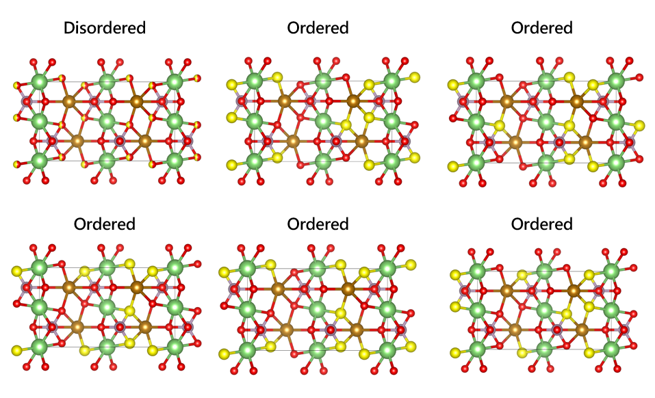

# 16. 自动消除分数占据结构

 ***¡Hola a todos!***

上一章介绍了怎么构建`disordered`分数占据结构，本章介绍怎么从`disordered`分数占据结构中生成可以直接计算的结构。

### OrderDisorderedStructureTransformation

上一章以`LiFePO4`为例，在`8a`O位点替换掺杂S元素，生成的`disordered`结构如下：

```tex
Full Formula (Li4 Fe4 P4 S0.8 O15.2)
Reduced Formula: Li4Fe4P4S0.8O15.2
abc   :  10.236196   5.970755   4.654917
angles:  90.000000  90.000000  90.000000
pbc   :       True       True       True
Sites (28)
  #  SP                       a         b         c
---  ----------------  --------  --------  --------
  0  Li+               0         0         0
  1  Li+               0.5       0         0.5
  2  Li+               0.5       0.5       0.5
  3  Li+               0         0.5       0
  4  Fe2+              0.218849  0.25      0.529866
  5  Fe2+              0.781151  0.75      0.470134
  6  Fe2+              0.281151  0.75      0.029866
  7  Fe2+              0.718849  0.25      0.970134
  8  P5+               0.093866  0.75      0.581377
  9  P5+               0.906134  0.25      0.418623
 10  P5+               0.406134  0.25      0.081377
 11  P5+               0.593866  0.75      0.918623
 12  S2-:0.1, O2-:0.9  0.165845  0.545558  0.713735
 13  S2-:0.1, O2-:0.9  0.834155  0.454442  0.286265
 14  S2-:0.1, O2-:0.9  0.334155  0.454442  0.213735
 15  S2-:0.1, O2-:0.9  0.665845  0.545558  0.786265
 16  S2-:0.1, O2-:0.9  0.665845  0.954442  0.786265
 17  S2-:0.1, O2-:0.9  0.334155  0.045558  0.213735
 18  S2-:0.1, O2-:0.9  0.834155  0.045558  0.286265
 19  S2-:0.1, O2-:0.9  0.165845  0.954442  0.713735
 20  O2-               0.044309  0.25      0.290136
 21  O2-               0.955691  0.75      0.709864
 22  O2-               0.455691  0.75      0.790136
 23  O2-               0.544309  0.25      0.209864
 24  O2-               0.094231  0.75      0.255213
 25  O2-               0.905769  0.25      0.744787
 26  O2-               0.405769  0.25      0.755213
 27  O2-               0.594231  0.75      0.244787
```

把上述结构提取对称性，可以更直观的看出替换信息：

```python
.......
final_LFP = SpacegroupAnalyzer(final_LFP).get_symmetrized_structure()
print(final_LFP)
```

输出：

```tex
SymmetrizedStructure
Full Formula (Li4 Fe4 P4 S0.8 O15.2)
Reduced Formula: Li4Fe4P4S0.8O15.2
Spacegroup: Pnma (62)
abc   :  10.236196   5.970755   4.654917
angles:  90.000000  90.000000  90.000000
Sites (28)
  #  SP                       a         b         c  Wyckoff
---  ----------------  --------  --------  --------  ---------
  0  Li+               0         0         0         4a
  1  Fe2+              0.218849  0.25      0.529866  4c
  2  P5+               0.093866  0.75      0.581377  4c
  3  S2-:0.1, O2-:0.9  0.165845  0.545558  0.713735  8d
  4  O2-               0.044309  0.25      0.290136  4c
  5  O2-               0.094231  0.75      0.255213  4c
```

下一步就是如何生成`ordered`结构，现在就是要用到`OrderDisorderedStructureTransformation`类：

- `algo`：使用的算法，可选：`ALGO_BEST_FIRST=2`、`ALGO_COMPLETE=1`、`ALGO_FAST=0`；默认为0。
- `symmetrized_structures`：输入结构是否包含对称性
- `no_oxo_states`：是否去除价态

在调用前，我们需要查看下输入结构信息，如果包含对称性，即上述后者的结构信息，则需要打开`symmetrized_structures=True`

其次，还需要判断初始结构中的`disordered`位点是否能够分配，否者则需要先超胞。通俗地讲，消除`disordered`位点的办法就是随机分配位点，如，上述`8a`O位惯用胞中总共有8个位点，但`O ：S`的占据比为`9 : 1`，如此一来则位点不够分配，则需要先超胞提供足够多的位点，然后再进行操作。

这里，为了方便直接跟惯用胞对比，我们改一下掺杂比例`O ：S`的占据比为`1 : 1`

```python
from pymatgen.transformations.standard_transformations import OrderDisorderedStructureTransformation
from pymatgen.io.cif import CifParser
from pymatgen.transformations.site_transformations import ReplaceSiteSpeciesTransformation
from pymatgen.symmetry.analyzer import SpacegroupAnalyzer
from pymatgen.io.cif import CifWriter

ini_LFP = CifParser('./LiFePO4.cif').parse_structures()[0]
symm_LFP = SpacegroupAnalyzer(ini_LFP).get_symmetrized_structure()

wyckoff_sites = SpacegroupAnalyzer(ini_LFP).get_symmetry_dataset().wyckoffs

oxygen_d_indices = [i for i, site in enumerate(wyckoff_sites) if site == 'd']

# 复制初始结构到最终结构
final_LFP = ini_LFP.copy()
# 对类型为'd'的氧原子位点进行物种替换
for i in oxygen_d_indices:
    indices_species_map = {i:{'O2-':0.5, 'S2-':0.5}}  # 替换比例为O2-:0.5, S2-:0.5
    trans = ReplaceSiteSpeciesTransformation(indices_species_map)  # 创建替换物种变换对象
    final_LFP = trans.apply_transformation(final_LFP)  # 应用变换到最终结构

# 先保存初始disordered结构
final_LFP = SpacegroupAnalyzer(final_LFP).get_symmetrized_structure()
CifWriter(final_LFP,symprec=0.01).write_file('./LiFePO4_doped.cif')

#实例化
trans = OrderDisorderedStructureTransformation(algo=0,symmetrized_structures=True)

# 生成结构
ordered_LFPs = trans.apply_transformation(input_struct,return_ranked_list=5)

# 保存结构
for i,struct in enumerate(ordered_LFPs):
    CifWriter(struct['structure'],symprec=0.01).write_file(f'./LiFePO4_doped_{i}.cif')
```

`apply_transformation`中`return_ranked_list=5`表示输出五个目标`ordered`结构，否则只会输出一个结构。

把输出结构导入`VESTA`查看：



**Note**：该方法进行分配时不会考虑对称性来较少目标结构的总数量，所以对于生成的`Ordered`结构，需要甄别一下再提交`VASP`计算。

 ***¡Muchas gracias!***
