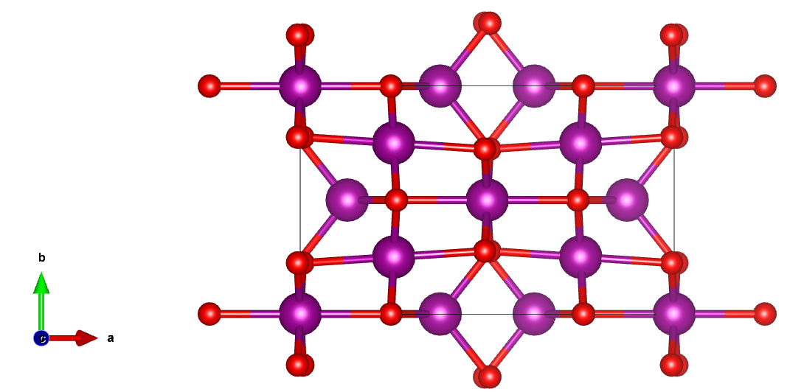
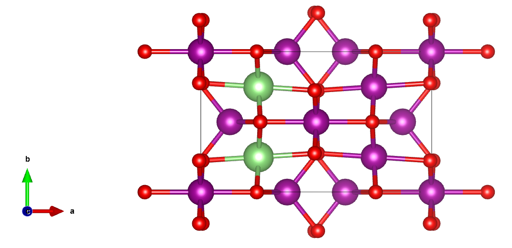
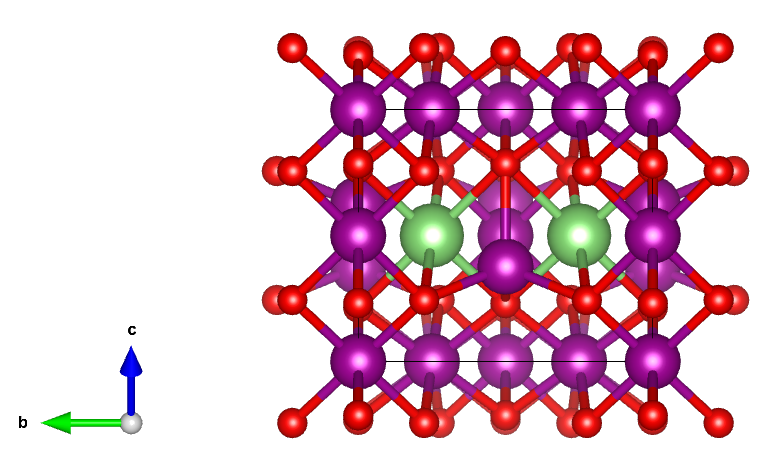
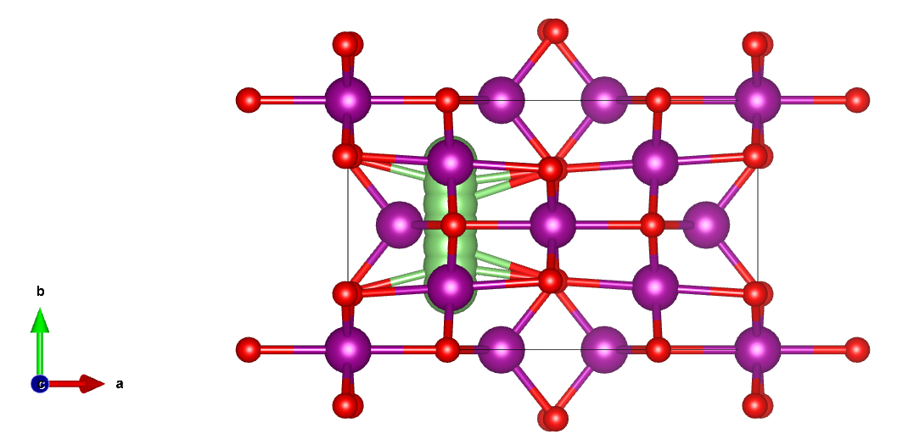
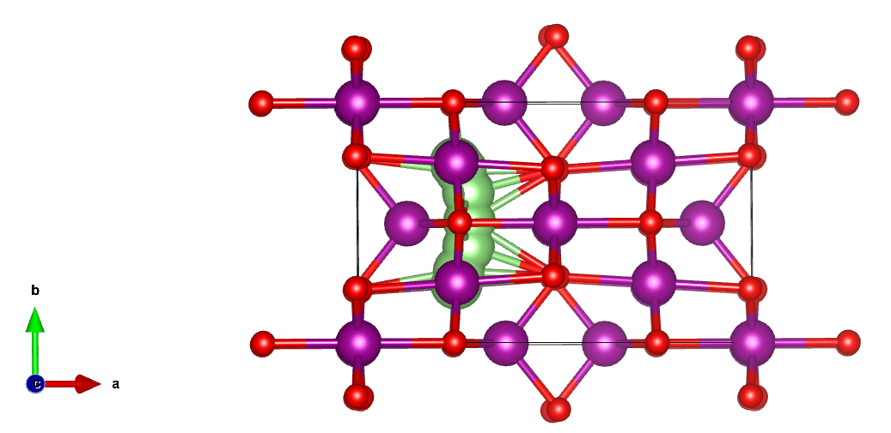

# 17. IDPP——更合理的迁移路径？

​`VASP`​学习中，`NEB`​计算相对于其他常规计算（`band`​ \ `dos`​ ）来说相对复杂一点。老司机在日常中计算`NEB`​也是会遇到很多问题：一直不收敛，插值结构散掉等问题。

**经验之谈：VASP计算中的问题，八成都与结构有关。**

### VTST(nebmake.pl)生成初始迁移路径

今天不谈`NEB`​计算中遇到的问题和解决方法，主要聊一下怎么生成更加合理的迁移路。合理的初始结构，大概率会极大规避计算中的问题以及加速收敛。

​`NEB`​的方法这里就不赘述了，目前一般都是用`CI-NEB`​来计算迁移势垒，那么却大多数人也是采用`vtst`​脚本`nebmake.pl`​来生成中间插值点结构，以编号`mp-18759`​的`Mn3O4`​结构为例：



如果我想计算b方向的`Li`​离子迁移势垒，先给出迁移方向的起始位点：





**上面图省事我把起始的Li原子放在一起进行展示**，实际上计算是要分别把结构保存为只含一个Li原子的结构，即`ini_structure`​和`fin_structure`​。使用`nebmake.pl`​，中间插5个点得到的路径如下：

```shell
nebmake.pl ini_structure fin_structure 5
```



​`nebmake.pl`​采用的是线性插值法，即两个端点的间距等分来生成插值点结构。问题就是可以很明显的发现路径左侧有一个`Mn`​原子离中间的插值点距离非常近，那么在优化的时候可能会有两种情况：

- Mn原子被挤开，这样会极大破坏母相的对称性结构
- Li原子被挤开

根据经验来说，Mn原子被挤开的概率比较小，大概率就是Li原子自行调整远离Mn原子。这样的话，很难说`nebmake.pl`​生成的路径是合理的，上述情况下会无形的延长收敛时间。

### IDPPSolver生成迁移路径

​`pymatgen`​中`IDPPSolver`​在初始迁移路径的生成上进行了优化，还是上面的例子，`IDPPSolver`​生成的路径如下：



显而易见中间生成的插值点自动“避开”了Mn原子，从结果上看使得迁移的路径更加合理，上面说过，合理的结构会极大的加速收敛过程。

与用`nebmake.pl`​生成的插值点相比，两者最后计算的势垒结果可能差别不大，但从计算速度上后者大概率完胜。

废话不多说，上`pymatgen`​代码：

```python
from pymatgen.analysis.diffusion.neb.pathfinder import IDPPSolver
from pymatgen.core import Structure

ini_structure = Structure.from_file("./Mn3O4_ini.cif")
fin_structure = Structure.from_file("./Mn3O4_fin.cif")

idpp = IDPPSolver.from_endpoints(endpoints=[ini_structure, fin_structure], 
								 nimages=5)
path = idpp.run()
```

在`idpp`​中传入了`ini_structure`​和`fin_structure`​，`nimages`​定义了插值点的个数；

​`path`​中包含包括初末态在内的所有插值点的结构，可以用以下代码分别输出保存：

```python
for i, struct in enumerate(path):
        struct.to(f"{i}.vasp", fmt='poscar')
```

当前路径下会生成`0.vasp`​ ~ `6.vasp`​，剩下的就是常规的`CI-NEB`​计算操作了~~~

代码非常简单，尽情尝试QAQ
