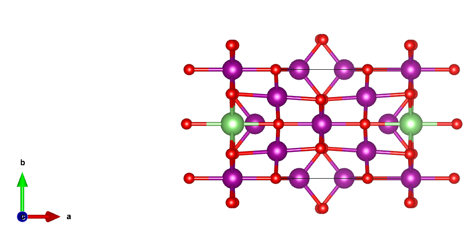
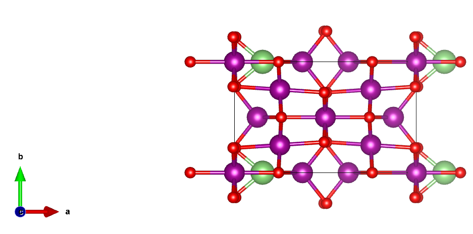
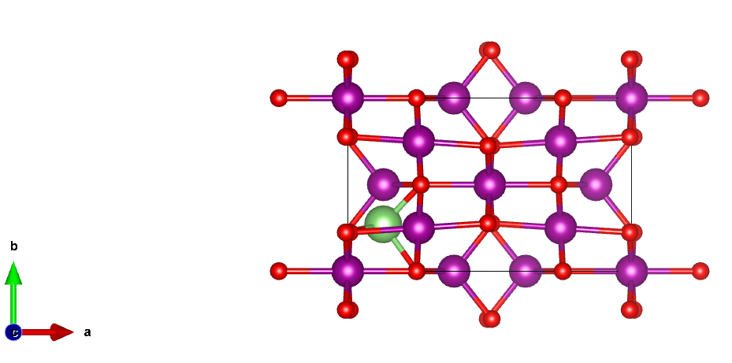
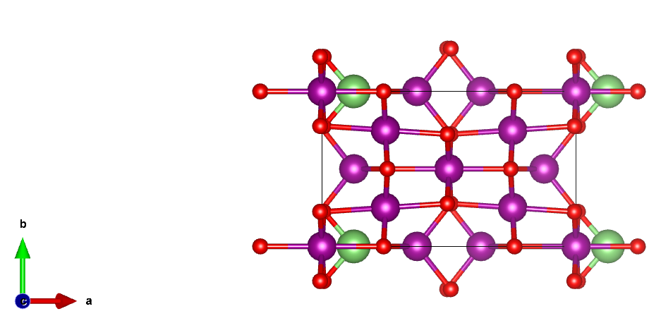

# 19. 老花眼选手怎么建缺陷结构——间隙掺杂

上一篇讲过点缺陷中的替换掺杂和空位，本篇接着介绍点缺陷中最后一种也是相对复杂的——间隙掺杂。

先上代码展示下结果：

```python
from pymatgen.analysis.defects.generators import ChargeInterstitialGenerator
from pymatgen.io.vasp import Chgcar

struct = Structure.from_file('/Mn3O4.vasp')
chg = Chgcar.from_file('/CHGCAR')
cig = ChargeInterstitialGenerator()
defects = cig.generate(chg, insert_species=['Li'])
for i, defect in enumerate(defects):
    print(defect)
```

打印输出：

```text
Li intersitial site at [0.00,0.50,0.00]
Li intersitial site at [0.15,0.00,0.41]
Li intersitial site at [0.12,0.27,0.60]
Li intersitial site at [0.12,0.00,0.88]
```

对应的`defect structure`​导入到`VESTA`​中：









主要用到`ChargeInterstitialGenerator`​方法，该方法通过读取`CHGCAR`​，根据电荷信息来筛选间隙位点。

同样地，掺杂结构可以通过以下代码保存：

```python
for i, defect in enumerate(defects):
    defect.defect_structure.to(filename=f'inters_{i}.cif')
```

该方法适用于在复杂结构中构建间隙掺杂，再也不需要用眼睛去找了，关爱视力，延长科研寿命~~~
