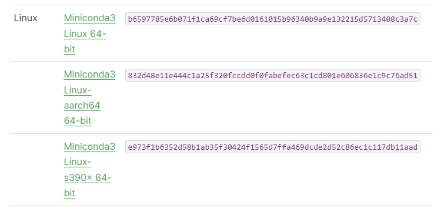
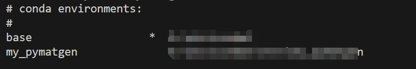
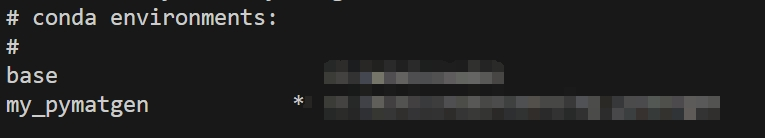
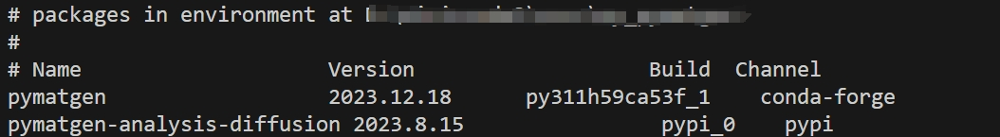
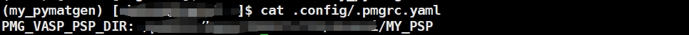

# 2. 环境配置

 ***¡Hola a todos!***

今天正式进入本系列内容，首先介绍下如何配置pymatgen相关环境，本章如果能全程跟下来且最后配置成功，那么恭喜你，该系列的核心内容已经完成了50%。

---

首先你需要一台已经编译好VASP的个人工作站或者使用已经编译了VASP的超算中心；有头铁的大哥想用自己的笔记本电脑也行，也请提前准备好虚拟环境编译好VASP。

然后开始配置pymatgen相关环境，[官网](https://pymatgen.org/installation.html)的安装教程已经相对详细了。但是考虑到本系列是“计算小白硬学VASP”，主打的就是我奶奶看了都会提交VASP任务，这里我就手把手，step by step 地走一遍配置过程。

**后续操作均在Linux环境下进行，个人工作站请在工作站上面操作，超算中心请在账号家目录下进行。**

## 安装Miniconda

Miniconda是一个开源的Python发行版本，它包含了conda、Python、pip等包管理工具，并且可以轻松安装、卸载、管理不同版本的Python环境。与Anaconda相比，Miniconda体量更小，安装速度更快，适合于个人用户、小型团队或学习目的（*官网教程也推荐Miniconda，我信Prof.Ceder*）。

### [官网](https://docs.anaconda.com/free/miniconda/)下载Miniconda安装包



### 进入到安装包目录下bash命令安装

`shell bash Miniconda3-latest-Linux-x86_64.sh `

### 验证Miniconda是否安装成功

`shell conda --version # 或conda -V `
如果安装成功，会显示conda的版本号。


## 配置pymatgen环境

### 为pymatgen创建独立的运行环境

为什么要创建独立的运行环境？

- 首先，不同package的对python以及其他依赖的版本有要求，为了避免跟base的环境相冲突，最简单的做法就是新建一个环境；
- 其次，对于超算用户，尤其是多人共用一个账号，配置新的环境避免与其他用户的使用需求相冲突，同时也有效的保护自己配置的环境不受影响。
  操作如下：

```shell
conda create --name my_pymatgen python
```

此时可以查看当前conda环境列表：

```shell
conda env list
```

出现下述环境列表，说明`my_pymatgen`环境新建成功，`*`号表示当前所使用的conda环境。

我们需要激活`my_pymatgen`环境来配置`pymatgen`，同时以后每次使用pymatgen都要记住激活`my_pymatgen`环境。

```shell
conda activate my_pymatgen
conda env list
```

此时可以看见已经激活my_pymatgen环境，`*`号变成了`my_pymatgen`。


### 安装pymatgen

直接通过conda命令安装pymatgen：

```shell
conda install -c conda-forge pymatgen
```

### 验证pymatgen安装成功

命令行输入：

```shell
conda list pymatgen
```

出现下述输出，说明pymatgen安装成功。  
​

**别着急，还没完！！！距离完成只差最后一步了~~~~~~~**

### 配置pymatgen势函数

最后我们需要配置一下势函数文件，首先你需要准备好VASP的势函数文件，由于版权问题，自行解决。一般势函数文件格式如下：

```shell
POT_PAW_PBE
├── Ac
│   ├── POTCAR
│   └── PSCTR
├── Ag
│   ├── POTCAR
│   └── PSCTR
```

上述初始势函数的路径记作`<EXTRACTED_VASP_POTCAR>`，然后再命令行中输入：

```shell
pmg config -p <EXTRACTED_VASP_POTCAR> <MY_PSP>
```

`<MY_PSP>`是你自定义配置`pymatgen`可以识别的势函数的路径，比如`my_psp`，然后会指定路径下生成一个`my_psp`文件夹，里面文件格式如下：

```shell
<MY_PSP>
├── POT_GGA_PAW_PBE
│   ├── POTCAR.Ac.gz
│   ├── POTCAR.Ag.gz
    ...
```

最后，需要把`<MY_PSP>`配置的pyamtgen环境变量中，这样才能在使用`pymatgen`时识别到自定义的势函数，命令行输入：

```shell
pmg config --add PMG_VASP_PSP_DIR <MY_PSP>
```

验证是否配置成功，可在根目录`.config/.pmgrc.yaml`文件中查看`PMG_VASP_PSP_DIR`配置项。

```shell
cat ~/.config/.pmgrc.yaml
```

出现如下信息，说明配置成功。


  
**VASP有许多不同的势函数，比如**​**​`PBE`​**​ **，**​**​`LDA`​**​**等等，这里我们只配置了**​**​`PBE`​**​**的势函数，如果你需要其他势函数，请自行配置。配置方法与上述相同，只需替换**​ **​`<EXTRACTED_VASP_POTCAR>`​**​**和**​ **​`<MY_PSP>`​**​**即可。**

```shell
pmg config -p /path/to/pseudos/potcar_PBE.54 /path/to/pseudos/pmg_potcars
pmg config -p /path/to/pseudos/potcar_LDA.54 /path/to/pseudos/pmg_potcars
pmg config --add PMG_VASP_PSP_DIR /path/to/pseudos/pmg_potcars
```

使用时注意指定势函数种类（后面会讲），或者直接把常用的势函数设置成默认选项，当然如果只添加了一种势函数，该步骤可以省略。

```shell
pmg config --add PMG_DEFAULT_FUNCTIONAL PBE_52
```

---

自此，前期准备工作基本已经完成，接下来就是正式进入实操阶段了，敬请期待！

 ***¡Muchas gracias!***
