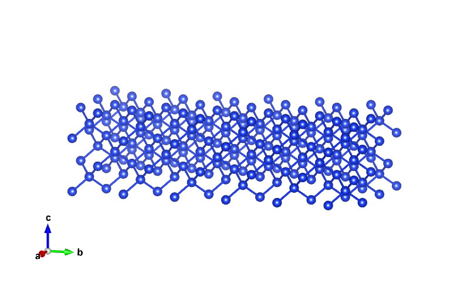
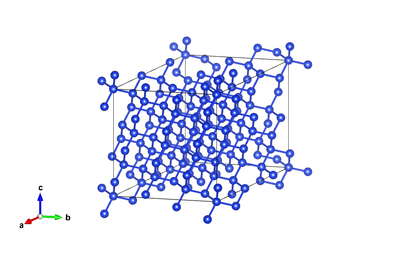

# 21. 构建“准Cubic”超胞结构

本期主要介绍一种通过非对角矩阵扩胞的方法来实现“准Cubic”超胞结构，为什么叫“准Cubic”，因为目前只能满足a，b，c尽量相等，$\alpha$，$\beta$，$\gamma$夹角没法严格等于90°。

通常来说，我们进行扩胞的矩阵都是对角矩阵，大白话就是平常文章中看到的沿着a,b,c方向扩了x, y, z倍超胞，这种是最常用的操作。但是你肯定在实际建模的时候总会遇到无论怎么沿着a,b,c方向扩胞，好像都没办法找到一个合适的超胞，要么胞太小，要么胞太大，要么就是“畸形”的超胞，何为“畸形”，就是为了满足原子数比如扩2x5x1这种10倍胞，得到的超胞结构毫无美感而且不好算。例如我要阔一个80个原子的Si原胞，就要采用2x5x1的扩胞方式，见下图：

‍

​

这种超胞模型拿来做掺杂实在算不上合理，以及缺失美感。

回到正题，`pymatgen`​提供了`supercell`​类来构建“准Cubic”：

```python
from pymatgen.analysis.defects.supercells import get_sc_fromstruct
from pymatgen.analysis.structure_matcher import StructureMatcher
from pymatgen.core import Structure

Si_structure = Structure.from_file('Si.vasp')

sc_matrix = get_sc_fromstruct(Si_structure,min_atoms=70, max_atoms=100)
sc = Si_structure.make_supercell(sc_matrix)
sc.to('Si_sc.cif')
matcher = StructureMatcher()

print(f'超胞变化矩阵：\n {sc_matrix}')
print(f'惯用包空间群信息：{Si_structure.get_space_group_info()}')
print(f'超胞空间群信息：{sc.get_space_group_info()}')
print(f'两个结构是否匹配一致：{matcher.fit(Si_structure,sc)}')
```

输出：

```text
超胞变化矩阵：
 [[ 2 -1  0]
 [ 0  2 -1]
 [ 0  1  2]]
惯用包空间群信息：('Fd-3m', 227)
超胞空间群信息：('Fd-3m', 227)
两个结构是否匹配一致：True

```

**代码解释：**

主要调用`get_sc_fromstruct`​方法来得到超胞变化的矩阵，`min_atoms`​和`max_atoms`​定义超胞大小的范围，代码会在这个区间来检索符合a≈b≈c的超胞变化矩阵。然后再根据超胞变化矩阵来导出超胞即可。

**超胞模型如下：**



```text
Full Formula (Si80)
Reduced Formula: Si
abc   :  11.886937  11.886937  11.886937
angles:  90.000000 101.536959 113.578178
```

**总结**

该方法提供了一种额外的超胞方法，在我们平常采用对角矩阵没办法构建合适的超胞时，不妨试一下该方法能不能满足建模要求。以及，老司机总感觉abc差不多的结构好算一点，不知道是不是错觉，有待验证~~~~~

‍
