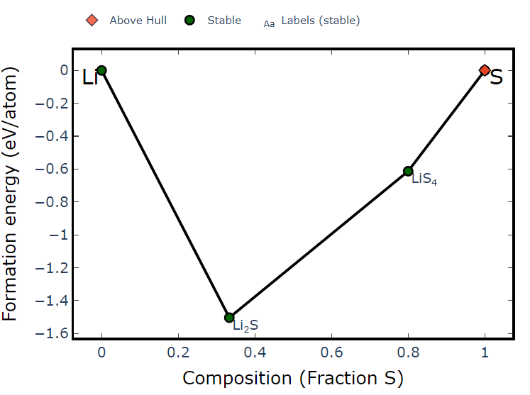
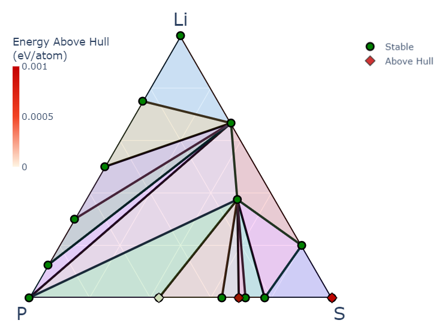
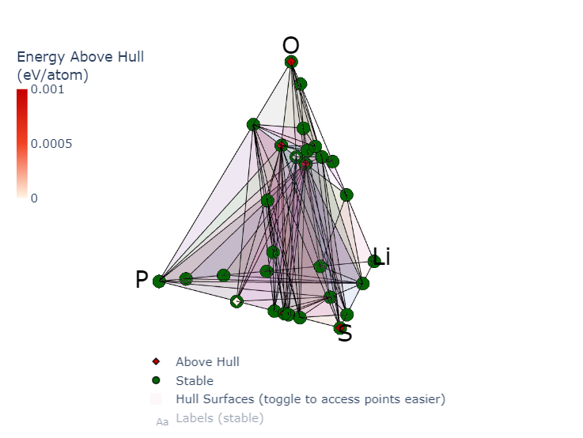

# 22. 直接扒MP数据快速分析相图

本期介绍如何直接扒`Materials Project`​的数据快速分析相图，主要调用`pymatgen`​中`phase_diagram`​里的方法。

### 二元相图

```python
from pymatgen.analysis.phase_diagram import *
from mp_api.client import MPRester

with MPRester() as mpr:
    binary_entries = mpr.get_entries_in_chemsys(elements="Li-S")
PD_binary = PhaseDiagram(binary_entries)
plotter = PDPlotter(PD_binary,show_unstable=0.001)
plotter.show()
```

自动开始抓取MP上面含`Li`​或`S`​元素的所有结构的能量，自动计算`Convex Hull`​。每个绿点即为稳定相结构。

​

### 三元/四元相图

同理，只需要调整元素总类就可以得到三元/四元相图

```python
from pymatgen.analysis.phase_diagram import *
from mp_api.client import MPRester

# 三元相图
with MPRester() as mpr:
    ternary_entries = mpr.get_entries_in_chemsys(elements="Li-S-P")
PD_ternary = PhaseDiagram(ternary_entries)
ternary_plotter = PDPlotter(PD_ternary,show_unstable=0.001)
ternary_plotter.show()

# 四元相图
with MPRester() as mpr:
    quaternary_entries = mpr.get_entries_in_chemsys(elements="Li-S-P-O")
PD_quaternary = PhaseDiagram(quaternary_entries)
quaternary_plotter = PDPlotter(PD_quaternary,show_unstable=0.001)
quaternary_plotter.show()
```

‍

输出结果：

​

​

由于数据量的原因，输出的结果图上面没有直接表明结构化学式。但是`pymatgen`​输出的结果默认是基于`plotly`​，是一个可交互式的图片，即鼠标移到哪个数据点上面就会显示对应数据的化学式和能量等信息。
