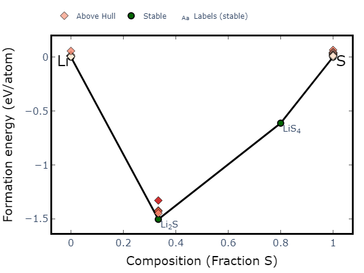
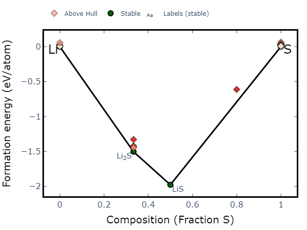

# 23. 读取新结构更新相图

上一期介绍了直接从MP上扒数据来分析相图，本期介绍如何在已有的相图数据上添加新的数据。

- 通过ComputeEntry手动添加

以二元Li-S相图为例，从MP上面直接分析的相图为：



此时如果要加入新的数据，可以调用`ComputedEntry`​在原本的`entries`​上添加即可：

```python
from pymatgen.analysis.phase_diagram import *
from pymatgen.entries.computed_entries import ComputedEntry
from mp_api.client import MPRester

with MPRester() as mpr:
    binary_entries = mpr.get_entries_in_chemsys(elements="Li-S")

# 新增一个entry，乱写的~~~~~
binary_entries.append(ComputedEntry(Composition("LiS"),energy=-10.0))

PD_binary = PhaseDiagram(binary_entries)
plotter = PDPlotter(PD_binary)
plotter.get_plot()
```

运行后可以得到新的相图：



- Vasprun直接读取

不想手写的话，可以直接从`vasprun.xml`​文件中读取`get_computed_entry()`​得到：

```python
from pymatgen.analysis.phase_diagram import *
from pymatgen.entries.computed_entries import ComputedEntry
from pymatgen.io.vasp.outputs import Vasprun
from mp_api.client import MPRester

with MPRester() as mpr:
    binary_entries = mpr.get_entries_in_chemsys(elements="Li-S")

# vasprun读取
vasprun = Vasprun('vasprun.xml')
new_entry = vasprun.get_computed_entry()
binary_entries.append(new_entry)

PD_binary = PhaseDiagram(binary_entries)
plotter = PDPlotter(PD_binary)
plotter.get_plot()
```
