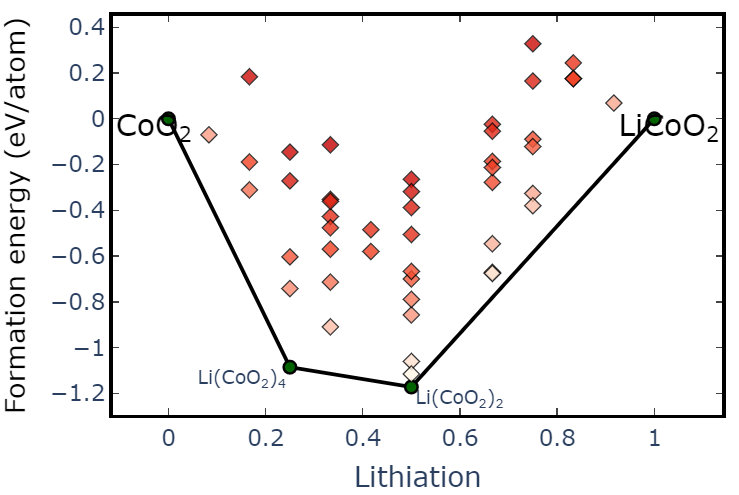
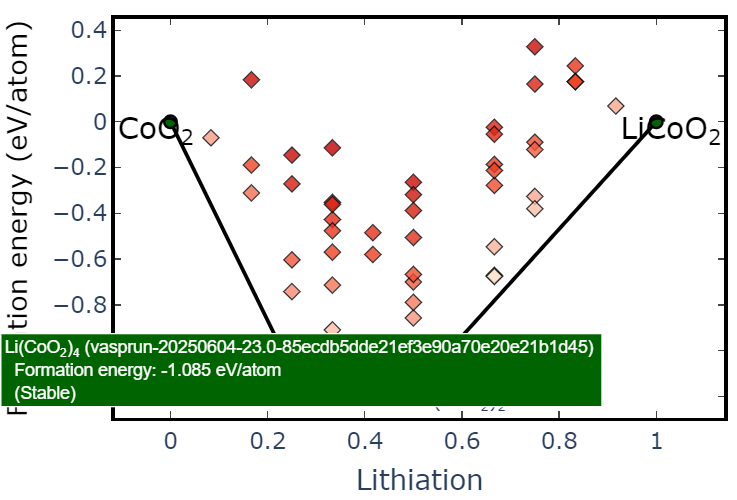
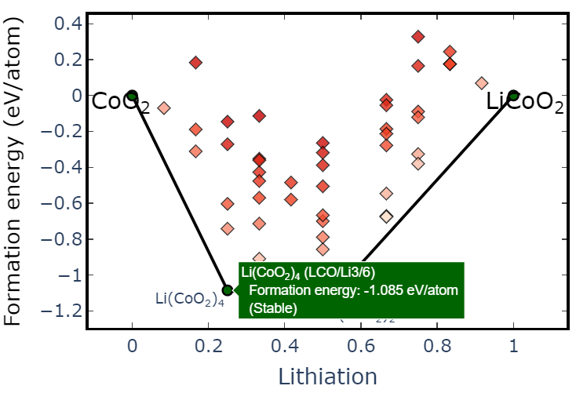

# 24. 相图计算如何快速定位stable结构

前面介绍了相图的计算，包含直接扒MP数据生成相图，以及用自己的计算数据来生成相图。

今天介绍怎么在相图计算的大批量数据里面定位到stable的结构，也就是位于convex hull line上的结构。以LiCoO2→CoO2脱锂过程的convex hull为例，选取2x2x1的超胞，此时结构包含12个锂，以步长为1依次脱锂，把每个结构通过`vasprun.get_computed_entry()`​方法添加到总的`entries`​里面（follow 不上的可以重温上一期）：

```python
entries = []
for struct in structs:
    vasprun = Vasprun('vasprun.xml')
    con_entry = vasprun.get_computed_entry()
    entries.append(con_entry)
```

现在`entries`​里面就包含了所有结构的`computed_entry`​，现在可以直接分析脱锂的convex hull：

```python
PD = CompoundPhaseDiagram(
		entries, 
		terminal_compositions=[Composition('Li12Co12O24'),Composition('Co12O24')], 
		normalize_terminal_compositions=False)
plotter = PDPlotter(PD, show_unstable=True)
fig = plotter.get_plot()
```



当然，对于convex hull的计算，出图不是主要的目的，最主要的是分析嵌锂态/脱锂态的stable结构进行后续的分析。常规方法当然是去对应的计算目录下，在同样锂含量的结构中去对比能量最低的结构，即stable结构。

这样非常的浪费时间，以及对于成千上万个结构的计算量来说，非常的不友好。

​`pymatgen`​给我们提供了一个方法，在画完convex hull之后可以直接准确定位到stable结构的路径，我们把鼠标移到上图中任意一个点，会直接显示基本的信息：



上图中Li(CoO2)4 (xxxx)对应的就是唯一的entry_id，看上去毫无规律可言，可能认为这个entry_id是乱取的，它可不是乱取的嗷！！

​`vasprun-{calc_date}-{calc_time}-{hashed_structure}`​

包含了计算日期，运行时间，结构编码~~~可以说是有备而来。

默认的id还是不够支持直观的定位结构，因此我们可以在生成`entries`​的时候自定义entry_id：

```python
entries = []
for struct in structs:
    vasprun = Vasprun('vasprun.xml')
    con_entry = vasprun.get_computed_entry(entry_id=f"{calc_path}")
    entries.append(con_entry)
```

这里可以直接传入计算的路径作为entry_id，然后convex hull出图后根据stable结构的信息就可以直接定位到对应的计算路径了。



完事~~~~

‍
