# 3. 学会使用MP数据库

 ***¡Hola a todos!***

很遗憾的告诉各位，本章还没有开始涉及到VASP的计算。

**Why????**

根据老司机以往的使用经验，做计算最关键的不是了解各种输入参数的意义，不是高超的编程能力，不是各种计算流程信手拈来，而是一个靠谱的结构。往往一个靠谱的结构，你的计算就已经成功了90%，这么说一点也不为过。一个“垃圾”结构，你往往算了几天、一周、一个月，得到的结果都不见得令人满意。

如何得到一个靠谱的结构，或者说到哪里去找一个靠谱的结构，这里不得不介绍一下本期嘉宾——[Materials Project](https://next-gen.materialsproject.org/)网站（下面简称MP）。截至到今天，MP提供了超过15万个无机化合物的结构信息以及性质，其中有实验已经发现的材料，也有纯计算预测的新材料。每一种化合物的计算源文件都可以免费下载本地，特别适合小白们自学VASP。

**当然，最重要的一点是，免费！免费！免费！Free~~~~~~~**

你只需要邮箱登录后就可以尽情使用


登录后进入主页，开始今天的MP学习之旅。

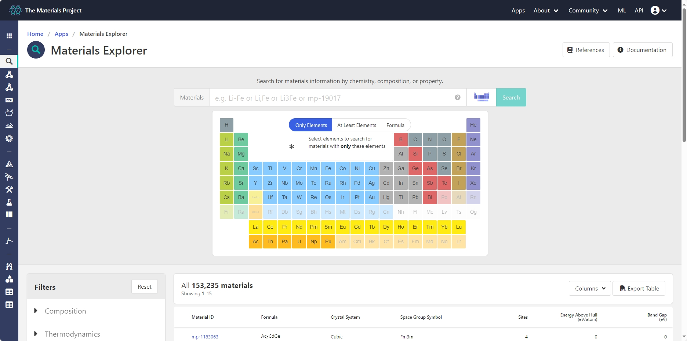

## Materials Project网页端

### 材料检索

MP上面材料的检索方式有三种:

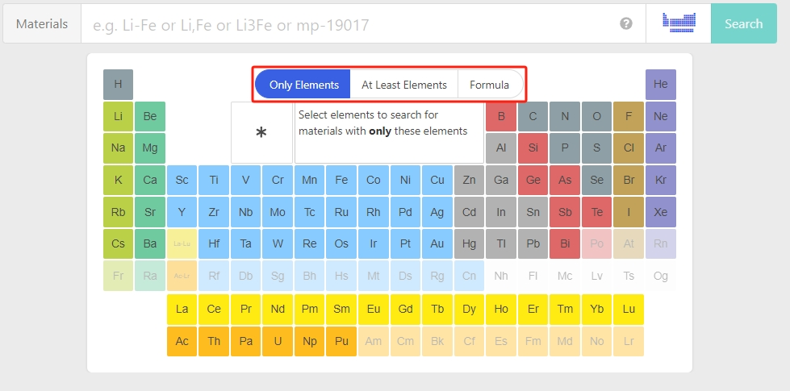

- `Only Elements`: 仅包含选定元素，如输入`Si`检索出来的结构只是单质硅；
- `At least Elements`: 至少包含选定元素，如输入`Si`检索出来的结构既有单质硅，也有含`Si`的化合物：`SiO`、`SiO2`等；
- `Formula`: 输入完整的分子式，如输入`SiO2`，检索出来的结构只有`SiO2`。

这里我们用`Only Elements`检索`Si`，可以得到一系列的`Si`单质结构。

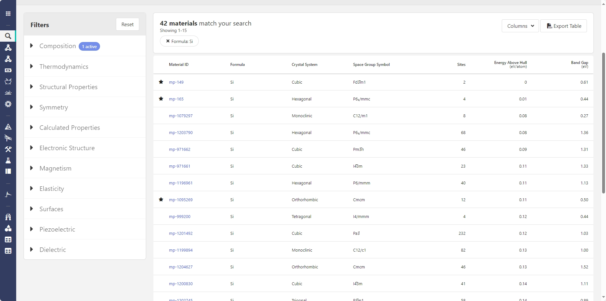

这么多`Si`单质结构，到底哪个是我们想要的呢？我们可以根据`Crystal System`、`Spacegroup`等信息筛选，这里我们以第一个`Si`结构为例，了解一下MP上面提供了哪些信息。

### 页面信息

`Summary`一栏基本提供了晶体结构的常见基本信息：MP编号(mp-149)、空间群信息、能带信息、磁性信息、实验上是否得到等。

  
**MP编号相当于材料的身份证，是Materials Project网站上每一个材料的唯一标识符，在后续会用到。**

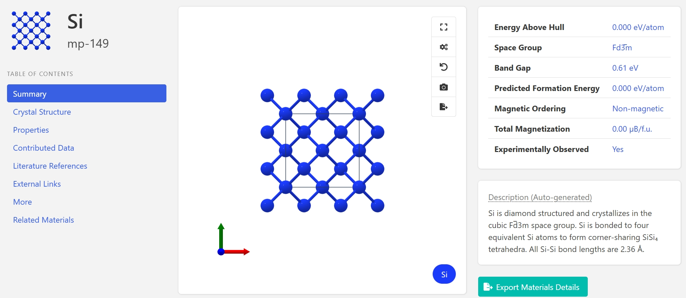

继续往下拉还可以看到具体的晶格常数信息，能带态密度图、模拟光谱信息等。

- 晶格常数信息

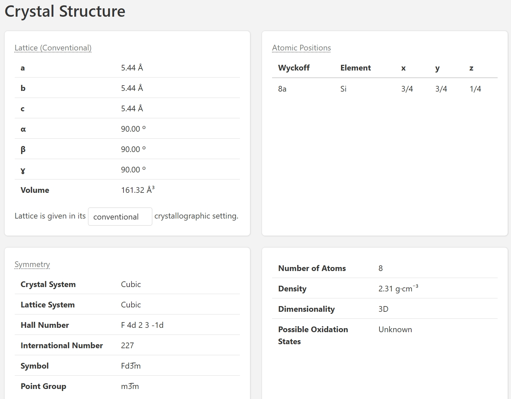

- 能带态密度图

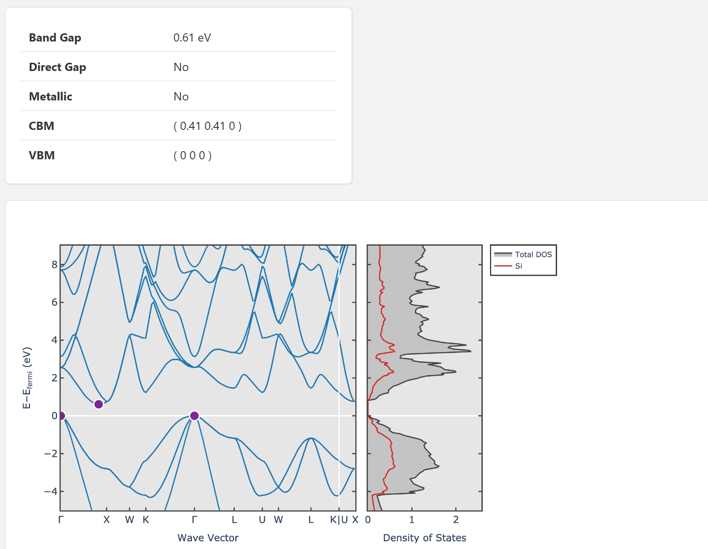

- 模拟光谱

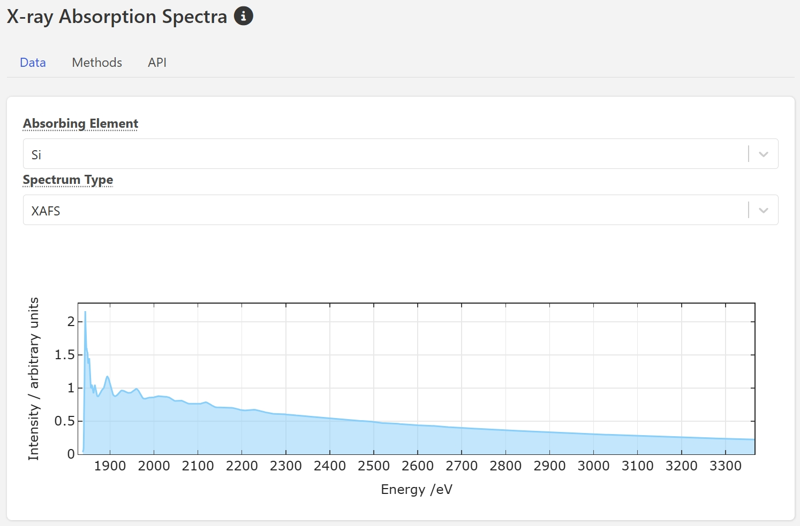

MP上面还有很多其他信息，大家可以自行探索，这里就不一一介绍了。

## MP-API接口

MP网页端的优势在于可以直观地看到材料的结构，但是从获取信息的角度来说，效率还是太低了。因此，MP还提供了API接口，可以方便地大批量获取到材料的结构、性质等各种信息。尤其适用于data mining、机器学习等领域。Anyway，即使你没有大规模数据下载分析的需求，对于日常使用来说，API接口用来找结构，查询信息还是很方便的。

### 如何使用Materials Project API

使用API接口非常简单，只需要几步即可。

- 获取API key
  在MP网页端注册账号，登录后，点击右上角的`API`，选择`API Key`，生成API Key即可，该字符串可复制保存，可长期使用。

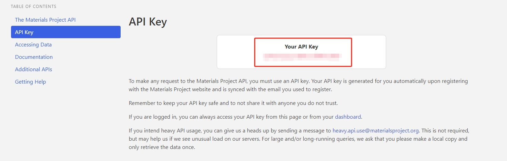

- 安装mp_api包

获取API key后，我们需要安装`mp_api`包，该包是Materials Project API的Python封装。后续的操作都需要在Python环境中进行，这个时候回到终端环境，激活`my_pymatgen`环境，可直接pip命令安装：

```shell
conda activate my_pymatgen
pip install mp_api
pip show mp_api
```

出现下面类似信息说明安装成功：

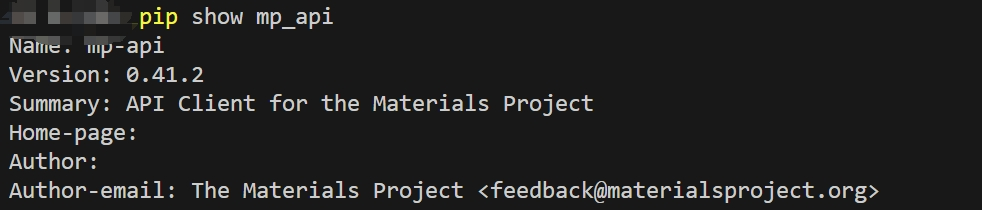

- 实例1：获取`Si`单质结构信息
  python脚本的编写推荐使用IDE工具，如VSCode、PyCharm等，或者Jupyter Notebook。下面的操作均以Jupyter Notebook为例，如果您不熟悉Jupyter Notebook，可以参考[Jupyter Notebook官方文档](https://jupyter.org/documentation)。

如果没有安装Jupyter Notebook，可以先安装：

```shell
conda install -c conda-forge notebook
```

然后在终端运行：

```shell
jupyter notebook
```

会跳转到外部页面，此时新建一个Jupyter Notebook文件，test.ipynb打开，输入以下代码：

```python
from mp_api.client import MPRester

api_key = "aaaaabbbbb"  # 请替换成你的API key

with MPRester(api_key) as mpr:
    # 获取Si单质结构信息
    structure = mpr.get_structure_by_material_id("mp-149")

    print(structure)          # 打印结构信息
```

这里我们是通过MP编号`mp-149`获取了`Si`单质结构信息，正如前文所说，MP编号相当于材料的身份证，是Materials Project网站上每一个材料的唯一标识符。

在Jupyter Notebook中运行代码命令为`Shift+Enter`，运行后会出现输出结果：

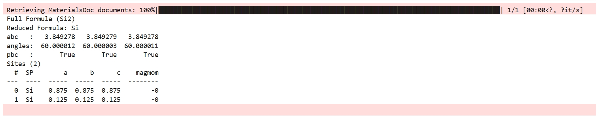

  
**无论是Jupyter Notebook还是VSCode，输出结果都是一样的。**

‍

### 检索材料信息

#### 实例1：根据MP编号获取材料信息

有人会说了，好像只打印出了一些简单的结构信息，并没有网页端的数据完整。别急，让我们丰富一下输出内容。MP-API提供了查询结构信息的方法`MPRester.materials.summary.search()`，通过这个函数方法，我们可以批量准确的查询到所需的材料信息，完整代码如下：

```python
import pandas as pd
from mp_api.client import MPRester

api_key = "aaaaabbbbb"  # 请替换成你的API key

with MPRester(api_key) as mpr:
    docs = mpr.materials.summary.search(
        material_ids='mp-149',
        fields=["band_gap", "density","formula_pretty", "symmetry"]
    )

data = []               # 空列表用于储存结果
for doc in docs:
    symmetry_info = doc.symmetry
    data.append({
        "band_gap": doc.band_gap,
        "density": doc.density,
        "formula_pretty": doc.formula_pretty,
        "symbol": getattr(symmetry_info, "symbol", "NONE"),
        "crystal_system": getattr(symmetry_info, "crystal_system", "NONE"),
        "space_group_num": getattr(symmetry_info, "number", "NONE")
    })

df = pd.DataFrame(data)  # 转换为DataFrame格式
print(df)
```

初次看到这个代码，可能会有点晕，不过不要着急，慢慢看，我们一步一步来。这个代码的逻辑主要分为两步：

- 1、调用api接口采用`MPRester.materials.summary.search()`查询编号为`mp-149`的材料具体信息，这里指定的字段有`band_gap`、`density`、`formula_pretty`、`symmetry`，分别表示带隙、密度、分子式、空间群信息：

```python
with MPRester(api_key) as mpr:
    docs = mpr.materials.summary.search(
        material_ids='mp-149',
        fields=["band_gap", "density","formula_pretty", "symmetry"]
    )
```

这里fields参数可以指定需要查询的参数，也可以不指定，默认会返回所有参数。`MPRester.materials.summary.search()`可以查询的参数详情可参考[官方文档](https://materialsproject.github.io/api/_modules/mp_api/client/routes/materials/summary.html)

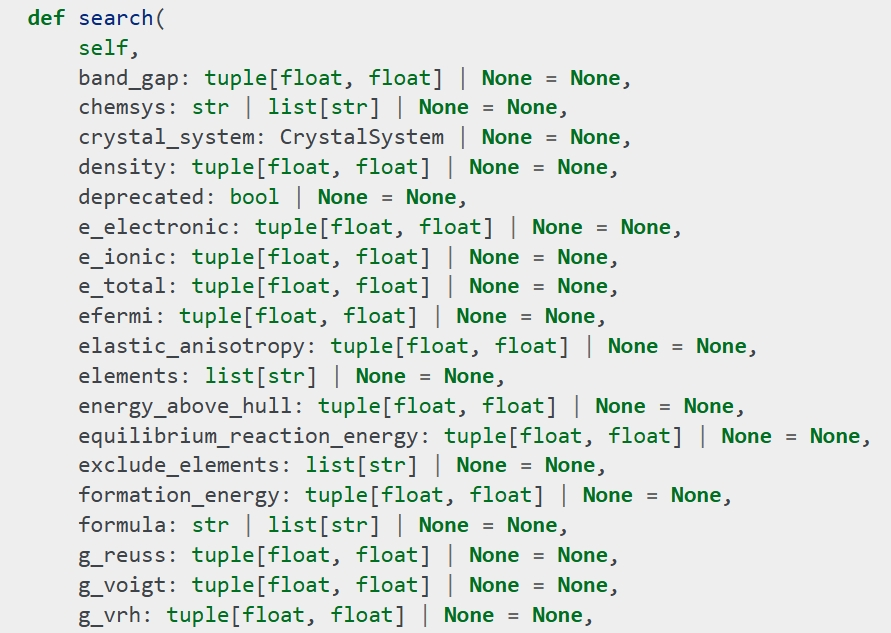

上述即为部分参数，每个参数表示的意义基本就是英文直译，另有不懂的也可以在文档中找到具体的说明。

回到代码，`docs`是一个列表，存储了我们制定的`fields`参数的信息，但是此时直接`print(docs)`输出的结果不利于查看，如果我们直接`print(docs)`，会看到：

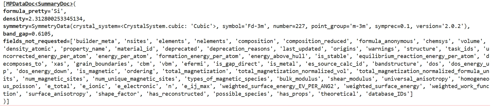

可以看到除了指定的参数，为写入`fields`的参数也会列出来，这样得到的结果老司机看到就头大，所以我们需要对其进行处理。

- 2、使用pandas库将查询结果转换为DataFrame格式并输出，也就是第二段代码：

```python
data = []               # 空列表用于储存结果
for doc in docs:
    symmetry_info = doc.symmetry
    data.append({
        "band_gap": doc.band_gap,
        "density": doc.density,
        "formula_pretty": doc.formula_pretty,
        "symbol": getattr(symmetry_info, "symbol", "NONE"),
        "crystal_system": getattr(symmetry_info, "crystal_system", "NONE"),
        "space_group_num": getattr(symmetry_info, "number", "NONE")
    })
df = pd.DataFrame(data)  # 转换为DataFrame格式
```

上述代码第2-11行用for循环遍历`docs`列表，将对应的属性储存在`data`列表中，具体提取的信息包括：

- band_gap: 材料的带隙
- density: 材料的密度
- formula_pretty: 材料的化学式
- symbol: 材料的空间群信息。使用getattr函数获取属性值，如果属性不存在，则使用默认值"NONE"。
- crystal_system: 材料的晶系（crystal system）。使用getattr函数获取属性值，如果属性不存在，则使用默认值"NONE"。
- space_group_num: 材料的空间群编号（space group number）。使用getattr函数获取属性值，如果属性不存在，则使用默认值"NONE"。

这里采用了getattr函数来提取`doc.symmetry`中的属性值，原因是因为`doc.symmetry`是一个字典，里面包含了多个属性，上述的`symbol`、`crystal_system`、`space_group_num`都是字典的键值。

第12行将`data`列表转换为DataFrame格式，运行print(df)后，可以得到如下结果：

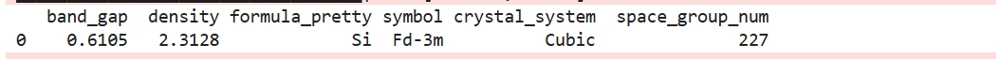

此次，我们通过MP-API根据MP编号获取了结构信息，并将其转换为DataFrame格式，方便后续分析，下面我们再试一下更有意思的玩法。

#### 实例2：根据元素获取材料信息

在上述代码的基础上，修改检索的条件，将通过MP编号获取改成通过元素获取材料信息，代码如下：

```python
......
......
with MPRester(api_key) as mpr:
    docs = mpr.materials.summary.search(
        elements=['Si','O'],
        fields=["material_id","band_gap", "density","formula_pretty", "symmetry"]
    )
......
......
```

其余代码保持不变，运行代码后，可以得到如下结果：

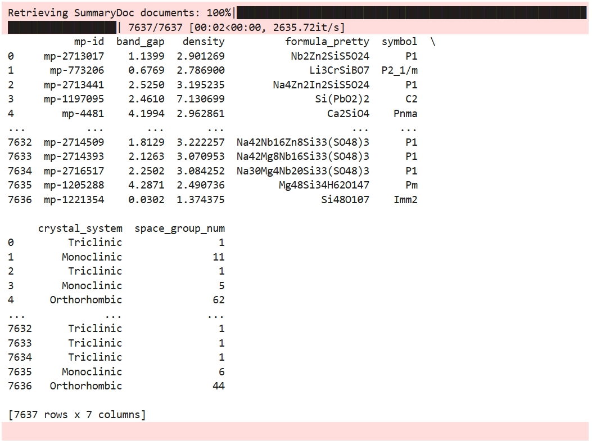

可以看到，这一次直接返回了所有含有`Si`和`O`元素的材料信息，一共有7637个结构。但是，如果我们并不想看到所有材料信息，而是只想看到其中只包含`Si`和`O`元素的材料信息，这时候我们需要继续添加筛选条件：

```python
......
......
with MPRester(api_key) as mpr:
    docs = mpr.materials.summary.search(
        elements=['Si','O'],
        fields=["material_id","band_gap", "density","formula_pretty", "symmetry"],
        num_elements=2
    )
......
......
```

`num_elements`参数限制了返回结果中的元素只有两种，即只包含Si和O的材料。运行代码后，可以得到如下结果：

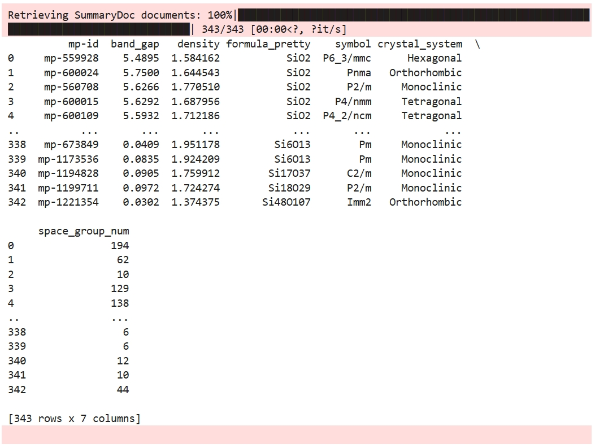

可以看到此时筛选得到的结构只有343个结构了。至此，大家应该明白了，MP-API的强大之处在于可以根据各种条件筛选材料信息，并进一步分析。根据不同的需求，只需要调节对应的限制参数，就可以得到所需的材料信息。如上述筛选条件还可以修改成：

- 2 ≤ 元素种类 ≤ 4
- 至少含有`Si`和`O`元素
- 带隙大于1.5的材料

代码如下：

```python
......
......
with MPRester(api_key) as mpr:
    docs = mpr.materials.summary.search(
        elements=['Si','O'],
        fields=["material_id","band_gap", "density","formula_pretty", "symmetry"],
        num_elements=(2,4),
        band_gap=(1.5,None)
    )
......
......
```

运行代码后，可以得到如下结果：

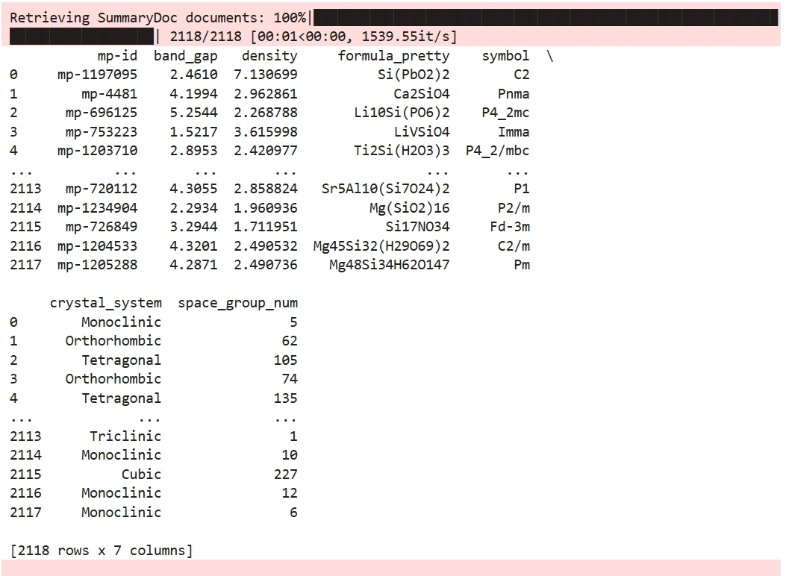

#### 实例3：小练习

相信如果全程跟着老司机一起操作的话，应该对如何筛选有了一定了解，可以自行尝试一下下面的筛选条件：

- 元素种类 ≥ 3
- 含有`O`元素
- 不含有：Fe、Co、Ni元素
- 0.5 ≤ 带隙值 ≤ 1
- 输出晶格常数abc
- 输出空间群信息

结果如下，可以自行对照检验：
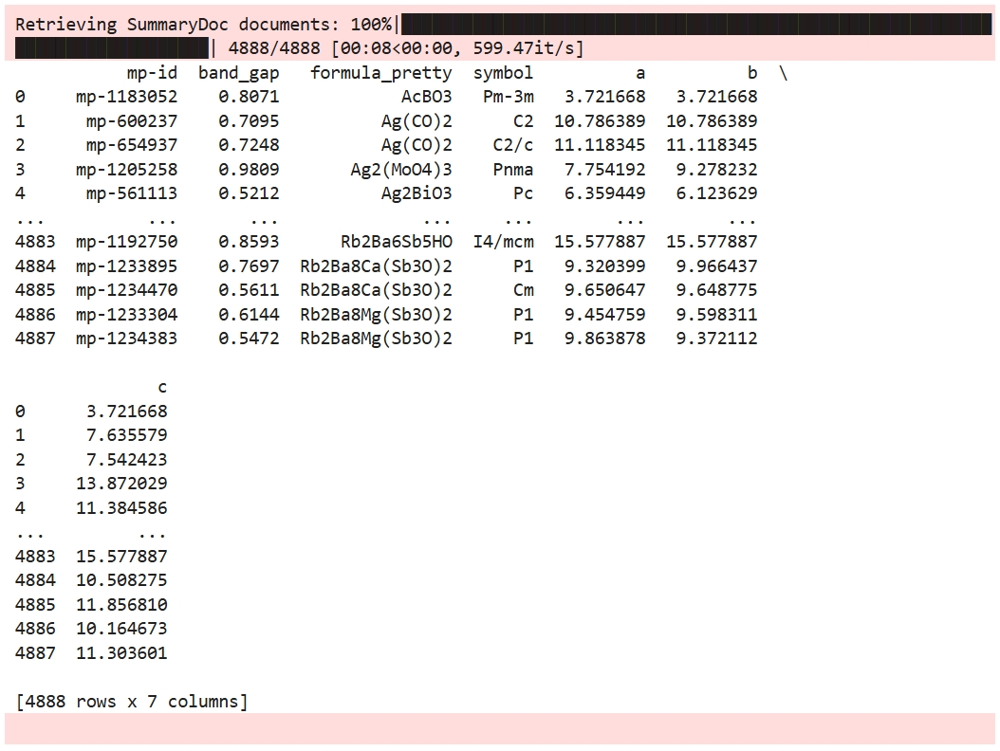

参考代码：

```python
import pandas as pd
from mp_api.client import MPRester

api_key = "aaaaaabbbbbbb"  # 请替换成你的API key

with MPRester(api_key) as mpr:
    docs = mpr.materials.summary.search(
        elements=['O'],
        exclude_elements=['Fe','Co','Ni'],
        fields=["material_id","band_gap", "structure","formula_pretty", "symmetry"],
        num_elements=(3,None),
        band_gap=(0.5,1)
    )

data = []               # 空列表用于储存结果
for doc in docs:
    symmetry_info = doc.symmetry
    structure_info = doc.structure
    data.append({
        "mp-id": doc.material_id,
        "band_gap": doc.band_gap,
        "formula_pretty": doc.formula_pretty,
        "symbol": getattr(symmetry_info, "symbol", "NONE"),
        "a": structure_info.lattice.a,
        "b": structure_info.lattice.b,
        "c": structure_info.lattice.c,
    })

df = pd.DataFrame(data)  # 转换为DataFrame格式
print(df)
```

‍

### 导出检索结果

DateFrame格式的材料信息，可以方便的进行分析和处理，但是如果需要将结果导出为其他格式，比如csv文件，这时候就需要用到pandas的to_csv()方法，上述代码最后加入如下一行代码即可：

```python
......
......
df = pd.DataFrame(data)
df.to_csv("result.csv", index=False)
print("Export result to result.csv")
```

运行代码后，会在当前目录下生成`result.csv`文件，打开csv文件后就可以看到检索结果了。

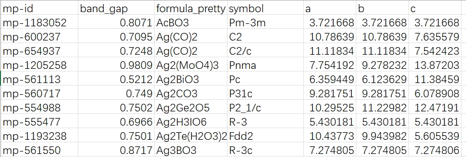

### 下载结构cif文件

如果下载上述csv文件的所有结构的cif文件，可以运行如下代码：  
**该代码会下载4000+个cif结构，请谨慎运行！！**

```python
import pandas as pd
from mp_api.client import MPRester

api_key = "aaaaaabbbbbb"  # 请替换成你的API key

with MPRester(api_key) as mpr:
    docs = mpr.materials.summary.search(
        elements=['O'],
        exclude_elements=['Fe','Co','Ni'],
        fields=["material_id","band_gap", "structure","formula_pretty", "symmetry"],
        num_elements=(3,None),
        band_gap=(0.5,1)
    )

data = []               # 空列表用于储存结果
for doc in docs:
    symmetry_info = doc.symmetry
    structure_info = doc.structure
    data.append({
        "mp-id": doc.material_id,
        "band_gap": doc.band_gap,
        "formula_pretty": doc.formula_pretty,
        "symbol": getattr(symmetry_info, "symbol", "NONE"),
        "a": structure_info.lattice.a,
        "b": structure_info.lattice.b,
        "c": structure_info.lattice.c,
    })

df = pd.DataFrame(data)  # 转换为DataFrame格式
df.to_csv("result.csv", index=False)
print("Export result to result.csv")

# 遍历所有材料并下载其 CIF 文件
    for doc in docs:
        material_id = doc.material_id
        structure = mpr.get_structure_by_material_id(material_id, final=True)
        structure.to(f"{material_id}.cif")
```

‍

如果只需要下载指定MP编号的cif文件，可以调用`get_structure_by_material_id`方法储存结构信息并写入到本地，这里我们下载`mp-149`的cif文件，代码如下：

```python
from mp_api.client import MPRester

api_key = "aaaaaabbbbbb"  # 请替换成你的API key

mpid = "mp-149"  

with MPRester(api_key) as mpr:
    structure = mpr.get_structure_by_material_id(mpid, final=True)
    
    structure.to(f"{mpid}.cif")
```

### 总结

MP-API的介绍就到此为止啦~~~~
目前为止，介绍了如何调用API接口；如果根据需求检索材料并汇总成csv文件；以及最后根据需求下载cif文件。当然，MP-API还有很多功能，比如获取结构的电子结构、能量等信息，这里就不一一介绍了。更多功能详解有需求后面再单独补充介绍。

 ***¡Muchas gracias!***

‍
