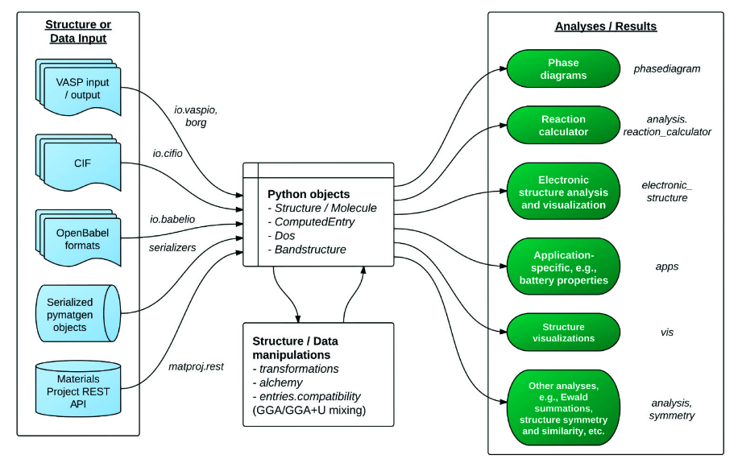
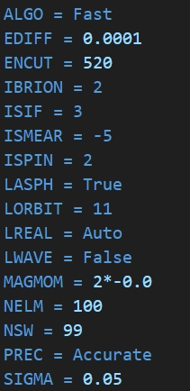
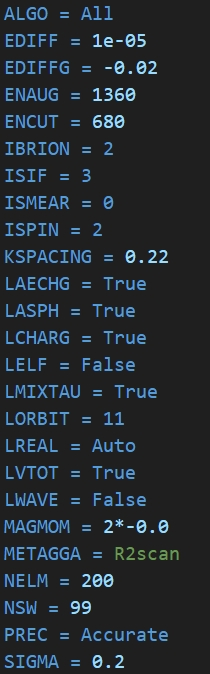
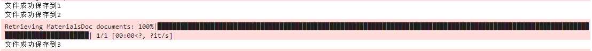
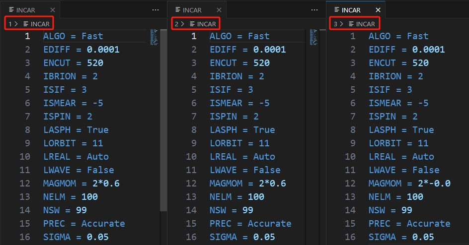
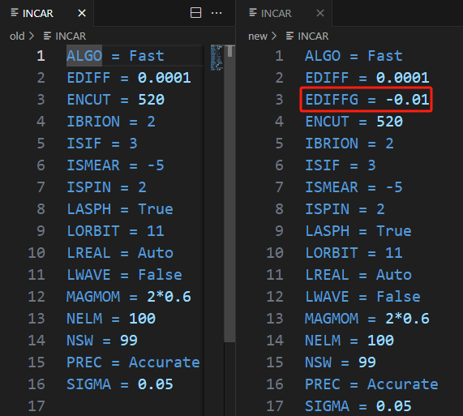

# 4. MPRelaxSet介绍

### Why pymatgen

完整的计算流程中除了第二步依赖于软件本身，其余的工作都需要花费大量的人力时间来操作。传统操作来讲，输入文件可能用`vim`、`Notepad++`、`VScode`等手动编辑；计算结果的处理除了用插件得到`raw_data`还需要用到`origin`手动作图。

对于少量计算来说，手动的亲力亲为的效率反而更高，但是遇到大量计算的计算操作，比如高通量计算，人的专注度是有限的，很容易就会出问题，老司机踩过的坑就包括但不仅限于以下：

- 修改后的`POSCAR`，忘记对应修改`POTCAR`
- 磁性体系没开`ISPIN`
- 未收敛的结果继续做自洽计算
- ......

这些操作看起来非常的离谱，初学VASP的兄弟肯定会说这个太夸张了。相信我，经历过大量计算的老哥们肯定或多或少都踩过类似的坑。

回到正题，why pymatgen？看看下面的图你就知道：



这个是`pymatgen`的功能示意图，不难发现，好像`pymatgen`把我们要干的活都给干了：

- 支持根据计算类型生成输入文件
- 支持识别多种格式的结构文件
- 支持分析计算结果
- ......

配合上`matplotlib`绘图，妥妥的实现整个计算流程脚本自动化：

代码一年写一次，一次用三年。

### 自动生成结构弛豫（优化）输入文件

#### MPRelaxSet or MPScanRelaxSet：如何选择合适的模块

本小节主要介绍下`pymatgen`中生成结构优化输入文件的模块的相关功能。看标题老司机给出了两个模块，这两个模块都是用于生成结构优化的输入文件，但是使用场景却有些许差别，需要根据使用场景和个人需求来自主选择。

总所周知，`pymatgen`就是由`Materials Project`的团队开发的，而`Materials Project`上的结构的相关数据也都是通过`pymatgen`的生成的输入来进行计算而得到。

那么问题来了，`Materials project`2011年就成立了，受限于当时的计算资源，面对如此庞大的高通量计算，当时的计算参数的设置稍显粗糙，放在如今的精度评判标准来看显然是不够的。为此官方也多次在`Github`的Issue里面提到过网页端的数据目前看来部分是`outdated`，但是官网也会定期的更新`datebase`，有兴趣可以看下每个版本都更新了哪些数据 [link](https://docs.materialsproject.org/changes/database-versions)。而已有的数据绝大部分都是基于`MPRelaxSet`模块优化的结构计算的。

下面是两个模块分别针对`Si`单质生成的`INCAR`词条对比：

           

不用去管每个词条是什么意思，单看词条数量，俗话说：”一寸长，一寸强“，单从词条的长度就可以大致凭借经验判断，短的可能精度比较低，没错，短的就是`MPRelaxSet`生成的。

那么是不是说明`MPRelaxSet`就不能用了呢？大可不必直接否定。

##### MPRelaxSet默认参数适用场景

- 相图计算

  相图的计算需要设计许多中间相结构的计算，而`Materials project`作为数据库已经记录了许多结构的标准化输入的能量，这些数据都是可以直接调用的，因此对我们计算相图提供了极大的便利。基于此，我们在补充结构进行计算时，也需要保持`Materials project`数据的默认设置，所以此时调用`MPRelaxSet`模块是相对合适的；
- 电化学窗口

  同理电化学窗口的计算也需要计算大量的结构。为此，这类需要调用`Materials project`上面结构能量数据来节省计算量的，可以使用`MPRelaxSet`模块；
- 粗收敛

  我们之前说过，好的结构是好结果的关键，那么其中重要的步骤就是优化过程。对于复杂结构：异质结、磁性体系、超大模型等，采用`MPRelaxSet`模块进行粗收敛来初步判断结构建模以及参数设置是否合理，同时不失为一个节省计算总时长的好办法。

‍

**如果需要对应**​**​`Materials project`​**​**上的结构数据，势函数的种类选择也要对应，这里先提一下留意一下，后面详细说明。**

‍

##### MPScanRelaxSet介绍

`MPScanRelaxSet`模块的使用条件就比较限制了，软件方面的适用条件：

- `VASP`版本6.0.0及以上
- 默认引入了更准确的`METAGGA = r2SCAN`方法，此方法要求`VASP`版本6.2及以上
- `METAGGA`要求势函数包含`kinetic energy density of the core-electrons`，也就是势函数必须要用`PBE_52`及以上版本

  看到这里是否有点不知道在讲什么，其实老司机也只是把文档的内容汉化成以上三点，平常我也是使用的`MPRelaxSet`模块，因为目前我使用的VASP版本还是5.4.4 `QAQ`

##### 总结

这里，老司机建议先使用`MPRelaxSet`模块就足够了，对于目前大部分`pymatgen`的用户来说，`MPRelaxSet`模块的使用还是占主要的。而且也不必担心计算精度问题，既然模块有默认参数，那么在使用过程中我们也可以根据需求进行调整精度。后续的计算也是基于`VASP_v5.4.4`，用`MPRelaxSet`模块实例。

***PS：*** 其实就是老司机使用的服务器没有`VASP_v6.0+`版本，不然高低也得详细对比测一下，给出更详细的使用建议。

#### MPRelaxSet使用实例

##### 实例1：生成Si单质结构优化输入文件

`MPRelaxSet`模块调用命令是：

```python
from pymatgen.io.vasp.sets import MPRelaxSet
```

`sets`里还包含其他模块，除上面的`MPScanRelaxSet`，还有`LobsterSet`、`MPAbsorptionSet`、`MPHSEBSSet`等等，后续有需要会一一介绍。

导入模块之后，我们必须提供的只有结构信息，而读取结构信息还需要用到的模块是`Structure`，同样也需要导入：

```python
from pymatgen.core.structure import Structure
```

###### 输入结构信息

`Structure`支持的结构信息类型非常多可以自己写，也可以只提供提供文件路径供识别：

- 手写晶格常数，元素种类，原子坐标

```python
from pymatgen.core import Lattice
from pymatgen.core.structure import Structure

# 晶格常数
lattice = Lattice([[4.2, 0.0, 0.0], [0.0, 4.2, 0.0], [0.0, 0.0, 4.2]])

#原子种类
species = ["Si", "Si"]

#原子坐标
coords = [[0.0, 0.0, 0.0], [0.25, 0.25, 0.25]]

#创建Si结构
struct = Structure(lattice, species, coords)
```

但是该方法极不推荐，why，因为很麻烦，而且复杂结构的原子坐标根本写不出来，但是对于单原子的结构建模，还是可以使用。

- 提供现成结构文件，目前可以识别的格式有：

1. Crystallographic Information Format file (.cif文件)
2. VASP输入输出中包含结构信息的文件：POSCAR、CONTCAR、CHGCAR、LOCPOT、vasprun.xml
3. CSSR、Netcdf、pymatgen结构JSON文件

前两种的结构文件是比较常见的，也是常用的：

```python
from pymatgen.core.structure import Structure

# 结构文件路径
poscar = "./POSCAR"		#当前文件夹下有POSCAR文件

struct = Structure.from_file(poscar)	#from_file用法是固定的，用于读取该路径下的结构文件
```

- MP-API获取结构：

```python
with MPRester(api_key) as mpr:
    struct = mpr.get_structure_by_material_id("mp-149") # Si的MP编号
```

这里Si的结构信息就被储存到`structure`变量了

###### MPRelaxSet生成并导出输入文件

结构准备好了之后，就可以直接生成输入文件了，下面是完整代码：

```python
from pymatgen.io.vasp.sets import MPRelaxSet
from pymatgen.core.structure import Structure
from pymatgen.core import Lattice
from mp_api.client import MPRester

## 方法1
# 晶格常数
lattice = Lattice([[4.2, 0.0, 0.0], [0.0, 4.2, 0.0], [0.0, 0.0, 4.2]])
#原子种类
species = ["Si", "Si"]
#原子坐标
coords = [[0.0, 0.0, 0.0], [0.25, 0.25, 0.25]]
#创建Si结构
struct1 = Structure(lattice, species, coords)
#调用MPRelaxSet
relax1 = MPRelaxSet(struct1)
#导出文件
relax1.write_input('./1')
print("文件成功保存到1")

##方法2
# 结构文件路径
Si_poscar = "./POSCAR"		#当前文件夹下准备Si的POSCAR文件
struct2 = Structure.from_file(Si_poscar)
#调用MPRelaxSet
relax2 = MPRelaxSet(struct2)
#导出文件
relax2.write_input('./2')
print("文件成功保存到2")

##方法3
api_key = "aaaaabbbbb"	#换成你的key
with MPRester(api_key) as mpr:
    struct3 = mpr.get_structure_by_material_id("mp-149")
    relax3 = MPRelaxSet(struct3)
    #导出文件
	relax3.write_input('./3')
    print("文件成功保存到3")
```

运行



当前路径生成三个文件夹，每个文件夹对于不同方法生成的输入文件，可以发现其中的`INCAR`几乎是一样的，除了方法3中`INCAR`的原子初始磁矩`MAGMOM`都设置成0了，这是因为方法3是直接读取的`Materials project`的数据，直接包含了磁矩信息，覆盖了默认设置。



##### 实例2：自定义输入参数（进阶设置）

前面我们讲了`MPRelaxSet`的默认参数精度是比较低的，正常来说，默认计算后得到的结构和能量数据都不建议使用。但是，不用担心，我们可以自定义输入参数，包括截断能、收敛标准，优化步数等等。

虽然前面讲过不需要去学习参数词条就可以学会VASP计算。严格来说实例1学会之后，任何结构你都可以生成输入去用VASP算一下看看结果。

本实例也可以说是进阶内容，主要是利于针对每个人自己对应的研究体系，能够设置相对合理的参数，需要对基本的`INCAR`词条有一定了解。

所以对该部分不感兴趣的可以直接跳过本小节，后面再看也可以。

###### user_incar_settings

之前的代码中，`MPRelaxSet`中我们只提供了结构，如果是用于自定义INCAR参数，还可以继续添加`user_incar_settings`来覆盖默认的设置，这里不需要写完整的所有INCAR设置，只需要写你想要改变的词条。

‍

`INCAR`词条有默认的设置，即使不写入`INCAR`里面也会在计算中采用默认的设置，详情默认设置的值以及解释见[VASP官网]([The VASP Manual -VASP Wiki](https://www.vasp.at/wiki/index.php/The_VASP_Manual))

‍

语法如下：

```python
from pymatgen.io.vasp.sets import MPRelaxSet
from pymatgen.core.structure import Structure

Si_poscar = "./POSCAR"
struct = Structure.from_file(Si_poscar)
relax_old = MPRelaxSet(struct2)
relax_new = MPRelaxSet(
    struct2,
    user_incar_settings={'EDIFFG':-0.01}
)
relax_old.write_input('./old')
print("Default settings have been written")
relax_new.write_input('./new')
print("New settings have been added")
```

运行后对比`new`和`old`文件夹里的`INCAR`



成功添加了`EDIFFG`词条，此时控制结构收敛的标准从能量收敛变成了更为严格靠谱的力收敛。

如果想修改更多的词条，我们也只需要在`user_incar_settings`对应的字典后面逐个添加即可：

```python
user_incar_settings={
    'EDIFFG':-0.01,
    'ENCUT':400,
    'NSW':200,
    'ISPIN':1,
    'ALGO':'Normal'
    ......
}
```

###### user_kpoints_settings

说完了`INCAR`的自定义设置，`KPOINTS`的自定义设置也类似。

- 调用`Kpoints`模块来生成

```python
......
from pymatgen.io.vasp.inputs import Kpoints

......
# 1.指定K点
kpoints = Kpoints(kpts=[(3,3,3)])

# 2.全自动K空间网格
kpoints = Kpoints.automatic(50)	# 50表示倒格子空间向量长度与分隔的K点的乘积

# 3.根据K点密度自动生成
kpoints = Kpoints.automatic_density(struct, 1000) # 1000表示K空间里整个K点的数量

# 4.与2类似，指定每条向量
kpoints = Kpoints.automatic_density_by_lengths(struct, [50,50,10])

# 5.根据体积平均生成K点
kpoints = Kpoints.automatic_density_by_vol(struct,500)

relax_new = MPRelaxSet(
    struct,
    user_incar_settings={'EDIFFG':-0.01},
    user_kpoints_settings=kpoints
)
```

**强烈推荐1和2方法**

- 修改`MPRelaxSet`默认KPOINTS设置

  在之前的代码中，我们并没有进行K点的相关设置，但是生成的输入文件中也给我们生成了`KPOINTS`文件。查阅官网文档内容可以发现，实际上K点的设置是已经给我们设置了默认的参数：`{'reciprocal_density': 64}`，此外还有其他的设置方式：

  ```python
  ......
  # 倒格子密度
  kpoints = {'reciprocal_density': 64}

  # 网格密度
  kpoints = {'grid_density': 500}

  # 全自动K点
  kpoints = {'length':30}

  relax_new = MPRelaxSet(
      struct,
      user_incar_settings={'EDIFFG':-0.01},
      user_kpoints_settings=kpoints
  )
  ```

  除上述外，官方支持的全部格式如下：

  1. `'grid_density'` for Kpoints.automatic_density generation
  2. `'reciprocal_density'` for KPoints.automatic_density_by_vol generation
  3. `'length'` for Kpoints.automatic generation
  4. `'line_density'` for line mode generation
  5. `'added_kpoints'` for specific k-points to include
  6. `'zero_weighted_reciprocal_density'` for a zero weighted uniform mesh
  7. `'zero_weighted_line_density'` for a zero weighted line mode mesh

###### user_potcar_settings

`POTCAR`的自定义设定主要是用于指定元素的势函数种类，语法如下：

```python
......
# pymatgen默认指定Li元素用Li_sv势，Na元素用Na_pv势，根据个人需求可改成调用普通的势
potcar = {
    'Li':'Li',
    'Na':'Na'
}

relax_new = MPRelaxSet(
    struct,
    user_incar_settings={'EDIFFG':-0.01},
    user_potcar_settings=potcar
)
......
```

###### user_potcar_functional

`MPRelaxSet`默认的函数指定的是`'PBE'`，前面说到，`MPRelaxSet`的相关设置都是比较落后的，在势函数上默认的选择也是比较老的`'PBE'`，尤其是目前vasp版本已经更新到了6.4了，势函数也更新到了`'PBE_64'`。

在上面的实操过程中，如果你的`<PMG_VASP_PSP_DIR>`路径下没有`'PBE'`势函数，可能会报错且没有文件生成：

`You do not have the right POTCAR with functional='PBE' and symbol='Si' in your PMG_VASP_PSP_DIR`

注意：这个并不是说咱的操作有问题，只是`MPRelaxSet`函数默认读取`'PBE'`，且`'PBE'`目前来说已经过时了。

因此在使用的时候，我们需要加上`user_potcar_functional`参数来指定我们使用的势函数，这里我用的是`'PBE_54'`:

```python
......
relax_new = MPRelaxSet(
    struct,
    user_incar_settings={'EDIFFG':-0.01},
    user_potcar_functional='PBE_54',
)
......
```

再次运行，可正常生成输入文件。

还没完！！！

运行完上述的命令，输入文件可以正常生成了，但是又有新的Warning：

> **BadInputSetWarning:**  Overriding the POTCAR functional is generally not recommended  as it significantly affect the results of calculations and compatibility with other calculations done with the same input set. Note that some POTCAR symbols specified in the configuration file may not be available in the selected functional.

> **BadInputSetWarning:**  POTCAR data with symbol Si is not known by pymatgen to correspond with the selected user_potcar_functional='PBE_54'. This POTCAR is known to correspond with functionals ['PBE_52_W_HASH', 'PBE_54_W_HASH', 'PBE_64']. Please verify that you are using the right POTCARs!  warnings.warn(

`VASP`计算中有句话：Warning不算报错，能算就继续算。

这里也是一样，这个Warning并不表示你的参数设置有问题，而是`VASP`官方会随着版本更新，相应的也会更新势函数的版本，同样地，`pymatgen`在更新的时候的时候也会同步把新版的势函数的`hash`值加入进来以便识别。简而言之，这个warning就是提醒你目前推荐的势函数版本是什么，比如这里推荐的是`'PBE_64'`。当然并不是说明`'PBE_54'`的势函数就是错的。官方`Github`的`Issue`里面有很多类似的讨论，这个Warning主要就是要提醒用户，了解自己在做什么。

#### 总结

`MPRelaxSet`的用法就介绍到这，本章干货满满，各位多多练习~~~~

 ***¡Muchas gracias!***
