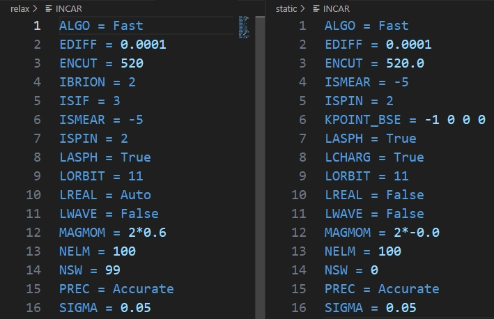
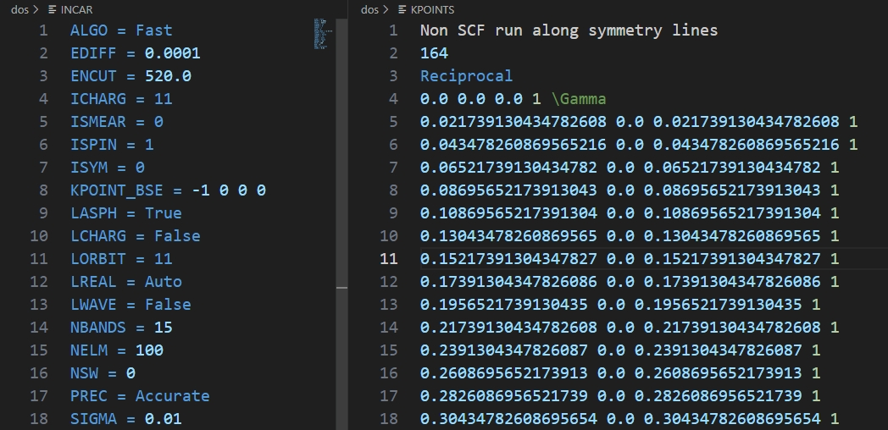

# 5. 态密度计算

 ***¡Hola a todos!***

上一章我们主要分享了结构优化的输入文件的生成，以及自定义输入文件参数；本章简单介绍下，对于Bulk模型来说，各类性质计算的输入文章生成，以及参数设置要点。

#### 简单自洽计算

性质计算的前提是进行结构优化得到稳定的结构。对于不同的性质计算，计算的步骤往往需要多步进行，例如态密度计算，需要先进行自洽计算得到电荷、波函数文件，然后再进行一步非自洽计算。

首先介绍下普通的自洽计算，用于得到电荷、波函数文件。

##### 调用MPStaticSet

自洽计算的输入文件生成可以调用`MPStaticSet`模块，以`Si`为例，默认生成输入文件如下：

```python
from pymatgen.io.vasp.sets import MPStaticSet

static = MPStaticSet.from_prev_calc(
    # 上一步优化的文件夹
    prev_calc_dir='./relax',
    user_potcar_functional='PBE_54'
	)


static.write_input('./static')
print("static_calc is ready!")
```

从用法上来说`MPStaticSet`的用法跟`MPRelaxSet`类似。但是这里细心的可以发现，这里老司机并没有提供结构文件，而是用了`from_prev_calc`方法，顾名思义就是读取前一步计算的文件进行计算，这里读取的就是之前优化计算的文件夹。

该方法通用于所有`set`类的模块，例如之前介绍的`MPRelaxSet`模块也可以使用，区别就是现在需要提供的是你希望读取的上一步计算的路径。该操作简而言之就是`VASP`中的续算操作。

运行上述代码后，可以得到如下`static`的`INCAR`：



与优化的`INCAR`对比可以发现，主要是修改了与优化有关的参数：`IBRION`、`NSW`；关于`ISMEAR`参数，`VASP`提供了比较友好的经验选择方法：

> - If you have no a priori knowledge of your system, for instance, if you do not know whether your system is an insulator, semiconductor or metal then always use Gaussian smearing ISMEAR=0 in combination with a small [SIGMA](https://www.vasp.at/wiki/index.php/SIGMA)=0.03-0.05.
> - For semiconductors or insulators, use the tetrahedron method (ISMEAR=-5), if the cell is too large (or if you use only a single or two **k** points) use ISMEAR=0 in combination with a small [SIGMA](https://www.vasp.at/wiki/index.php/SIGMA)=0.03-0.05.
> - For relaxations *in metals*, use ISMEAR=1 or ISMEAR=2 and an appropriate [SIGMA](https://www.vasp.at/wiki/index.php/SIGMA) value (the entropy term should be less than 1 meV per atom). For metals a reasonable value is often SIGMA= 0.2 (which is the default).
> - For the calculations of the DOS and very accurate total-energy calculations (no relaxation in metals), use the tetrahedron method (ISMEAR=-5).

**上述INCAR的设置为MPStaticSet的默认设置，针对具体性质计算，需要调整的词条参数不同**

#### 态密度计算

态密度计算需要先进行一步自洽计算，然后进行一步非自洽计算得到最终的态密度数据。在第一步的自洽计算我们只需要得到电荷文件`CHGCAR`和`CHG`就可以了（`WAVECAR`文件较大，且态密度非自洽计算可以不读`WAVECAR`），而上一步`MPStaticSet`默认输出电荷文件（`LCHARG = True`)，所以自洽计算的参数不用过多调整。下面主要介绍非自洽计算用到的模块。

##### 调用MPNonSCFSet

我们可以先看下`MPNonSCFSet`模块默认生成的`INCAR`是什么样的：

```python
from pymatgen.io.vasp.sets import MPNonSCFSet

nonscf_dos = MPNonSCFSet.from_prev_calc(prev_calc_dir='./static', user_potcar_functional='PBE_54')

nonscf_dos.write_input('./dos')
print("DOS_calc is ready!")
```

运行代码：



默认的`INCAR`中增加`ICHARG`词条，当`ICHARG≥10`时，计算过程中电荷密度不进行自洽更新，`CHGCAR`和`CHG`文件内容不变，即非自洽计算。

态密度计算仅读`CHGCAR`​即可，即只用复制`CHGCAR`​至态密度计算文件夹。

**如果使用**​**​`MPNonSCFSet`​**​**的**​**​`from_prev_calc`​**​**方法，默认会复制上一步自洽计算的**​**​`CHGCAR`​**​**文件到当前文件夹；如果只用**​**​`MPNonSCFSet`​**​ **，则需要指定结构文件**​**​`struct`​**​ **，以及自行把**​**​`CHGCAR`​**​**复制到当前目录。**

##### 自定义参数设置

此外，本小节主要介绍`DOS`​计算，默认的INCAR参数中，部分的设置是不太合理的，或者说不利于后续的数据分析。

**前面提到，**​**​`VASP`​**​**对许多词条的值有默认值，如果不在**​**​`INCAR`​**​**中覆写，计算采用的就是默认值**

- `EMIN`：态密度能量下区间（默认值：`lowest KS-eigenvalue - Δ`）
- `EMAX`：态密度能量上区间（默认值：`lowest KS-eigenvalue - Δ`）
- `NEDOS`：态密度的网格点数（默认值：301）
- `ISPIN`：是否考虑电子自旋

上述的三个参数根据作图需求进行调整，比如态密度图主要是分析费米能级附近的占据情况，实际计算时，默认的能量区间可能非常大，同时`NEDOS`的数值是确定的，所以会一定程度降低费米能级附近的精度。因此，如果你只需要费米能级附近的信息，可以在`INCAR`中指定能量区间，如`EMIN=-8`、`EMAX=8`，然后选取适当的`NEDOS`(推荐2001)，这样的话精度是比较合适的，作图也不会因为`NEDOS`数量过少而出现锯齿线条。`ISPIN`本身是控制体系是否考虑自旋，一般认为是与磁性计算有关，但是在态密度计算中，是否考虑自旋影响最后输出的数据是否把自旋向上的轨道与自旋向下的轨道区分开。

- `LORBIT`：决定投影轨道的形式（常用设置为10和11）

`LORBIT=10`时，态密度投影的轨道只包含s/p/d/f轨道；`LORBIT=11`时，态密度除了输出总的轨道信息，还会投影到分轨道上，如`px`、`py`、`pz`等。

总的来说，计算前先确定`LORBIT`​的数值来决定是否需要分轨道的数据，然后再确定`ISPIN`​、`EMIN`​、`EMAX`​、`NEDOS`​的数值来考虑作图需求。

**磁性体系必须打开**​**​`ISPIN`​**​

##### KPOINTS文件

`MPNonSCFSet`模块默认生成的`KPOINTS`文件中的K点写法是`line-mode`，该方法一般用于能带结构的计算。因此在态密度计算中，我们可以写常规的K点进行覆盖：

```python
from pymatgen.io.vasp.sets import MPNonSCFSet

kpoints = {
    "length":100,
}

nonscf_dos = MPNonSCFSet.from_prev_calc(
    prev_calc_dir='./static', 
    user_potcar_functional='PBE_54',
    user_kpoints_settings=kpoints,
)

nonscf_dos.write_input('./dos')
print("DOS_calc is ready!")
```

**态密度计算的K网格要足够大才算的准，在普通结构优化的K点个数2倍以上，大体系算不动可适量降低。**

#### 总结

态密度计算就介绍到这，各位多多练习~~~~

 ***¡Muchas gracias!***

‍
