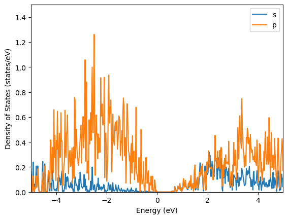
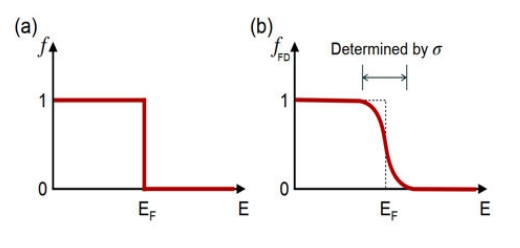
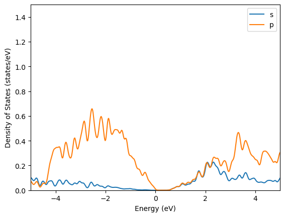
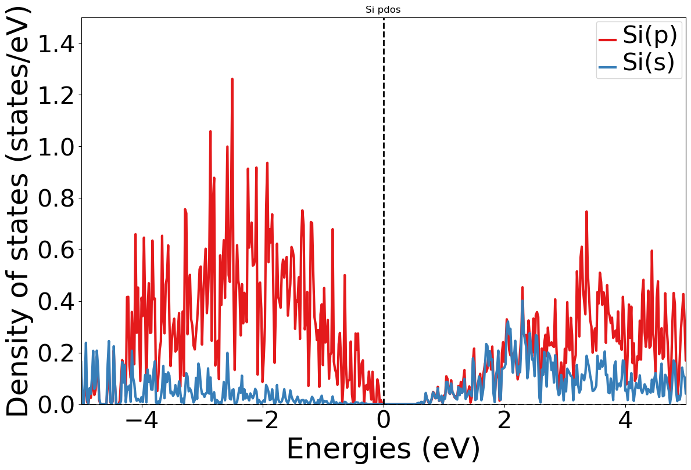
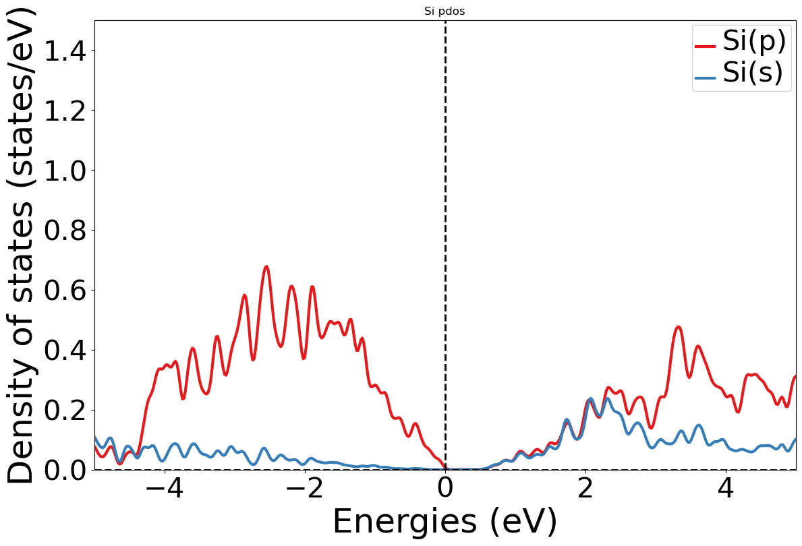

# 7. 态密度图绘制

 ***¡Hola a todos!***

本章主要介绍态密度画图的两种的方法。

##### 常规方法——Matplotlib

上一章介绍了如何分析dos计算的结果，并根据需求把态密度轨道数据保存为csv文件。在此基础上常规绘图方法就是采用`matpltolib`库的`pyplot`模块。代码如下：

```python
from matplotlib import pyplot as plt
import pandas as pd

# csv文件
# 以Si的分轨道为例
csv_file = './Si_sp_dos.csv'

# 读取csv文件
df = pd.read_csv(csv_file)

# 取出需要的数据
energy = df['Energy']
s_orbital = df['Si_s']
p_orbital = df['Si_p']

# 画图
plt.plot(energy, s_orbital, label='s')
plt.plot(energy, p_orbital, label='p')
plt.legend()
plt.xlabel('Energy (eV)')
plt.xlim(-5,5)
plt.ylabel('Density of States (states/eV)')
plt.ylim(0,1.5)
plt.show()
```

运行代码：



这里可以看到态密度画出来，毛刺非常多，原因可以分为两个部分：

\- 在设置`INCAR`时，NEDOS的数量较大或`EMIN`,`ENMAX`的区间过小，导致取点非常密集；

\- 主要原因还是在`INCAR`中，`ISMEAR = -5`时，`sigma`为0，费米狄拉克分布，不会有展宽（见下左图），这就导致相邻的态是直接过渡的，没有考虑平滑处理，所以画出来的dos图普遍毛刺比较多。这也是为什么也有很多人在算态密度的时候选择`ISMEAR = 0`，出图放文章里面会好看一点。



##### 手动平滑处理——scipy.ndimage.gaussian_filter1d

当然，`python`有许许多多其他的库可以用来平滑处理，这样就避免了我们重新设置参数进行计算。这里采用`scipy.ndimage.gaussian_filter1d`模块进行平滑处理，代码如下：

```python
from matplotlib import pyplot as plt
from scipy.ndimage import gaussian_filter1d
import pandas as pd

# csv文件
# 以Si的分轨道为例
csv_file = './Si_sp_dos.csv'

# 读取csv文件
df = pd.read_csv(csv_file)

# 取出需要的数据
energy = df['Energy']
# 平滑处理
s_orbital = gaussian_filter1d(df['Si_s'], sigma=3)
p_orbital = gaussian_filter1d(df['Si_p'], sigma=3)

# 画图
plt.plot(energy, s_orbital, label='s')
plt.plot(energy, p_orbital, label='p')
plt.legend()
plt.xlabel('Energy (eV)')
plt.xlim(-5,5)
plt.ylabel('Density of States (states/eV)')
plt.ylim(0,1.5)
plt.show()
```

运行代码：



也可以得到相对客观的结果。这里平滑度由`sigma`参数控制，根据需求需自行调整。

##### pymatgen自带模块——DosPlotter

DosPlotter是专门用于绘制态密度图的类，可以直接从VASP计算的输出文件中读取数据并绘制，并且绘图结果默认把费米能级平移至0eV，方便比较。

代码如下：

```python
from pymatgen.io.vasp.outputs import Vasprun
from pymatgen.electronic_structure.plotter import DosPlotter
from pymatgen.electronic_structure.core import OrbitalType, Spin
import matplotlib.pyplot as plt

# 读取 vasprun.xml 文件
dos_vasprun = Vasprun('./dos/vasprun.xml')
complete_dos = dos_vasprun.complete_dos

# 定义一个字典，用于存储 PDOS
pdos_dict = {}

# 定义一个字典，用于存储元素和对应的轨道列表
element_orbitals = {
    'Si': [OrbitalType.s, OrbitalType.p],
}

# 遍历元素和对应的轨道列表
for element, orbitals in element_orbitals.items():  
    # 创建一个空字典储存当前元素的所有轨道列表
    pdos_dict[element] = {}         
    # 遍历当前元素的轨道列表
    for orbital in orbitals:        
    # 对于当前元素的当前轨道，将 PDOS 存储在 pdos_dict 字典中   
        pdos_dict[element][str(orbital)] = complete_dos.get_element_spd_dos(element)[orbital]

# 实例化 DosPlotter 对象
dos_plotter = DosPlotter()
# 添加 PDOS
for element, orbitals in pdos_dict.items():
    # 此行遍历当前元素的 PDOS 字典，其中每个键是轨道的名称，对应的值是该轨道的 PDOS
    for orbital, pdos in orbitals.items():      
        pdos_data = dos_plotter.add_dos(f'{element}({orbital})',pdos)

# 绘制 PDOS
dos_plotter.get_plot(xlim=(-5,5),ylim=(0,1.5))
plt.title('Si pdos')
plt.show()
```

运行代码：



直接使用`DosPlotter`也可以绘制出类似的结果，然而`DosPlotter`绘制的结果会自动标出费米能级参考线，即`x=0`参考线，同时自身还提供了平滑曲线的功能，`DosPlotter`可以接受的参数有：

\- `zero_at_efermi`：布尔值，是否将费米能级作为零点，默认值为`True`；

\- `stack`：布尔值，是否绘制成面积图，默认值为`False`；

\- `sigma`：浮点数，平滑曲线的标准差，值越大，曲线约平滑。

这里重新修改下，增加`sigma`参数使得曲线平滑一点：

```python
......

# 实例化 DosPlotter 对象
dos_plotter = DosPlotter(sigma=0.05)

......
```

再次运行代码：



曲线平滑了非常多，但是具体使用过程中，`sigma`参数的选择还是很重要的，如果过于平滑，可能会失去重要的性质，所以实际使用时，需要根据实际情况进行调整。

##### 总结

既然第二种方法可以直接画，那为啥还要费老鼻子劲输出csv文件呢，是否多此一举。

实际上，上一步输出csv文件跟这一步画图的操作并不冲突，输出csv文件是为了保存绘图源数据，`vasprun.xml`文件虽然包含了计算的所有数据，但是动辄几百兆的大小也不太适合作为长期保存的文件。

推荐的做法是，无论怎么画图，都最好导出相关的数据保存为csv文件。小规模的计算结果的处理，两者差异不大；但是对于高通量来说，如果需要批量处理画图，直接读取csv文件绘图要快得多。例如上面两种方法，直接读csv绘图运行时间只要`0.1s`；第二种方法读`vasprun.xml`文件绘图，运行时间可能需要`4.3s`,这个差距就比较明显了。

话虽如此，但是在高通量计算过程中，主要是的时间消耗还是在计算上，绘图上面的时间差在`VASP`计算的时间上可以忽略不计~~~~~~

简而言之就是，记得保存数据，画图爱用啥用啥，都一样，无非就是代码不一样，`DosPlotter`预设了一些格式，而直接用`matplotlib`就自行设置一下格式（字体、字号、排版）就好了。

 ***¡Muchas gracias!***
